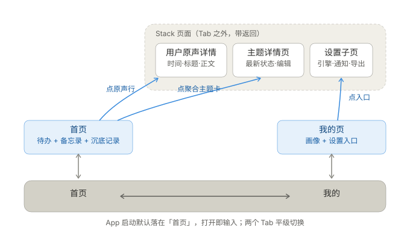
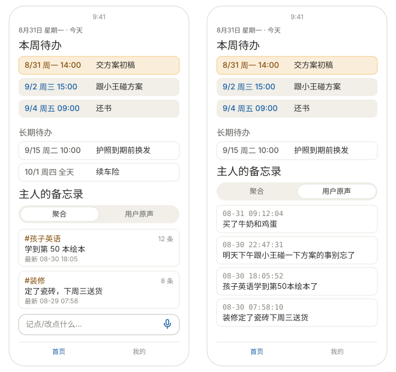
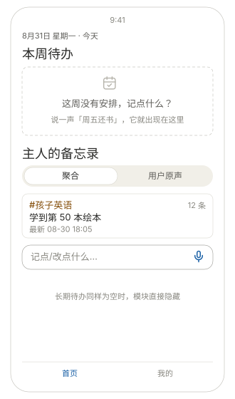
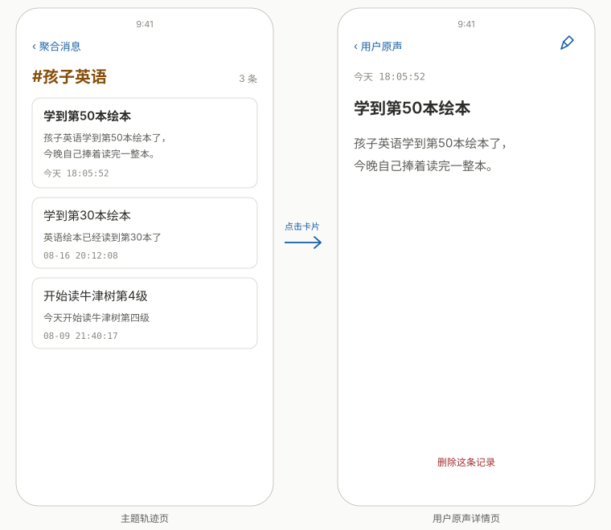
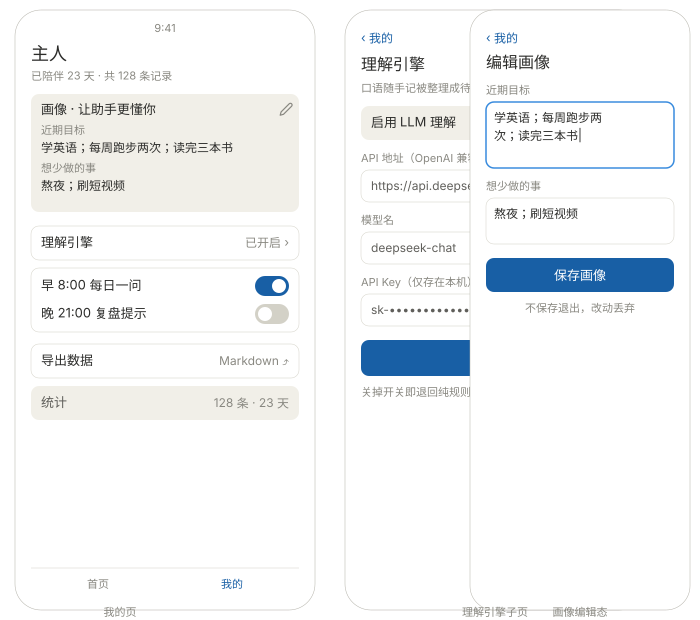
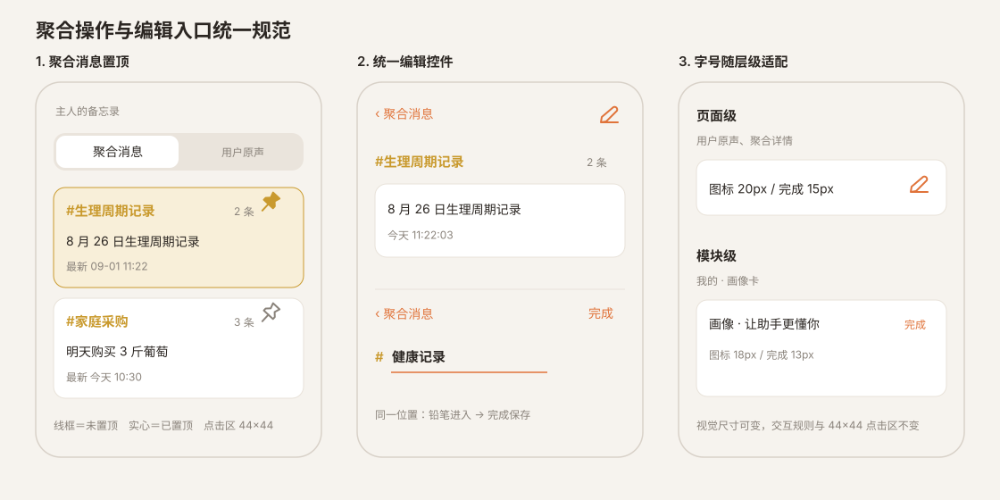
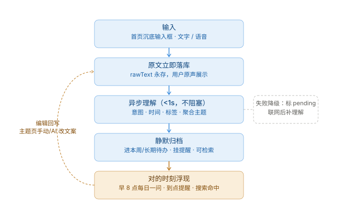

# 个人助手 App — 页面设计稿 v1.1

> 状态：已与产品 owner 逐轮对齐定稿（2026-08-31；2026-09-01 真机验证后修订）
> 配套文档：需求见 `PRD.md`；本文件只描述页面结构、布局与交互规则

## 整体结构

- **2 个底 Tab**：`首页` ｜ `我的`
- **Tab 外 stack 页面**：详情页（用户原声 / 主题）、理解引擎子页，均带返回
- App 启动默认落在「首页」，打开即可输入

## 导航动线

```
底 Tab 栏：  首页 ⇄ 我的
              │
首页 ──点用户原声行/时间流卡─▶ 用户原声详情页（时间 · 标题 · 详细内容 · 删除）
首页 ──点聚合主题卡─────────▶ 主题详情页（#主题 · 条数 · 标题 · 最新状态 · 历史轨迹）
我的 ──点入口──────────────▶ 理解引擎子页（其余行内完成，不开子页）
```



## 首页（从上到下）

1. **顶部小字**：当天日期 + 星期（如「8月31日 星期一 · 今天」），不是记录时间戳
2. **本周待办**（页面主标题，18px，无「首页」大标题）
3. **长期待办**（次级模块，14px 次要色标题）
4. **主人的备忘录**（页签模块：`聚合消息` ｜ `用户原声`；标题样式与本周待办一致：18px 500）
5. **Composer 沉底固定**：输入框带描边，占位文案「记点/改点什么…」，右侧麦克风图标（不用文字），键盘弹起随之浮起



### 模块一：本周待办

- 数据窗口：**今天起向后 7 天**，按时间排序（2026-09-01 改版：**逾期项不进本模块**，经搜索/备忘录可达）
- 每行结构：**行首圆形勾选框**（勾选即完成，完成时撤销到点提醒）+ 时间标签 + 待办概要；今天的行高亮（警示色）
- 时间标签（2026-09-01 定稿：无小时，今天/明天带具体日期）：今天 → `今天 9/1 周一`；明天 → `明天 9/2 周二`；后天起 → `9/3 周三`；长期待办同款去小时
- **无待办的日期整行不展示**，列表自然收紧
- **7 天全空空态**：标题保留，模块不塌缩；虚线框 + 日历图标
  - 主文案：「这周没有安排，记点什么？」（提问式，不催促）
  - 副文案：「说一声『周五还书』，它就出现在这里」（口语示例教学）



### 模块二：长期待办

- 数据窗口：**今天 +7 天之后**的所有未完成待办，按时间升序
- 每行结构：`日期 + 星期 + 时间`（如 `9/15 周二 10:00`，与本周待办同构）+ 待办概要
- 视觉降噪：描边卡无底色，是「备查区」，不抢本周待办焦点
- **无长期待办时整个模块隐藏**
- 流转：进入 7 天窗口自动升入本周待办

### 模块三：主人的备忘录 · 页签 1「聚合」

- 主题卡与时间流卡（LLM 未成功理解、无主题的记录）混排
- **主题卡四要素**：
  1. 主题名（如 `#孩子英语`）
  2. 包含原始信息条数（如 `12 条`）
  3. 标题 = 最新一条内容概要
  4. 最新时间：最新条目有 dueAt 时显待办标签（如 `最新 9/12 周六`，2026-09-01 需求），否则显记录相对时间戳
- 点击卡片：主题卡 → 主题详情页；时间流卡 → 用户原声详情页
- 两页签顶部各带搜索框（放大镜图标 + 边框输入条，无文字占位说明；2026-09-01 改版：原声页签也加同款搜索）

### 模块三：主人的备忘录 · 页签 2「用户原声」

- 流水视图，只做记录展示，不做理解加工；按 createdAt 倒序
- 卡片样式与聚合页签一致（白底圆角描边卡）；每行结构：**时间戳**（等宽字体 12px 暗色，格式 `MM-DD HH:mm:ss`，跨年补年份）+ **rawText 当前文本**（15px，完整显示可换行，不截断、不提炼）
- 交互：顶部搜索框（2026-09-01 新增，与聚合消息页签同款，FTS 命中原声子集）；点卡片进用户原声详情页

## 详情页（stack 页，两种）



### 用户原声详情页（用户原声行 / 时间流卡点入）

参考 **iOS 备忘录（Apple Notes）**交互模式（2026-09-01 定稿）：

1. 顶部导航行：`‹ 用户原声`（左，accent）｜ ✏️ 手动编辑 / `完成`（右，进出编辑态）
2. 完整时间戳（createdAt，等宽 13px 暗色）
3. 标题（summary，18px 600）
4. 正文（rawText 当前文本，16px 次要色；标题=正文时只显示一次）
5. 删除 = 正文下方**居中小字链接**「删除这条记录」（红色 13px，非按钮；仍二次确认）

**手动编辑**（2026-09-02 调整）：

- 右上仅保留 ✏️ **手动编辑**；用户原声详情页不提供语音输入
- 点击进编辑态，**只有标题+原文输入框（无麦克风、无「原文」小标签）**；「完成」保存（同文条目两字段同步写）；**无改动点完成 = 直接退出编辑态**
- 编辑中点返回（‹）弹「丢弃确认」；保存经 applyCorrection（快照入 correctedFrom）；**topic 不变** → 聚合归属不受影响
- 返回聚合消息详情页/各列表页时 useFocusEffect 重载即见新内容

### 主题详情页（聚合主题卡点入）

页头即 `#主题名 + 条数`，不设独立标题行（避免与最新状态重复）：

1. 返回（回到聚合页签）
2. `#主题名`（大）+ 条数（小字）
3. **最新状态卡**（高亮）：最新一条的概要 + rawText 小字 + 时间戳
4. **历史轨迹**：倒序卡片流（概要 + rawText 小字 + 时间戳），卡片样式与最新状态卡统一
5. **全部卡片点击即编辑**（2026-09-01 改版）：底部三按钮栏已删除；编辑态卡片右下浮出「取消｜保存」

**卡片交互（2026-09-01 二次改版）**：

- **所有卡片（最新状态卡 + 历史轨迹卡）点击 → 跳转该条的用户原声详情页**（手动编辑在那里完成）
- 底部按钮栏已删除；本页不再有原地编辑
- 每张卡显示：概要（大字）+ 原始输入（小字）+ 相对时间戳；最新状态卡橙底高亮
- 返回本页时 useFocusEffect 重载，展示编辑后的新内容

## 我的页



- **页头**：`主人`（18px，与首页标题同级）+ 一行陪伴数据（已陪伴 N 天 · 共 M 条记录）
- **画像卡**（高频）：近期目标 / 想少做的事，右上角铅笔进编辑态
  - **编辑态**：字段变可编辑（高亮边框）+「保存画像」主按钮；保存即生效；**不保存退出则改动丢弃**；为空时显示占位示例
- **分组列表**（不开子页，原地完成；仅理解引擎进 stack 子页）：
  - 理解引擎 ›（如「已开启」；LLM 开关打开但 Key 为空时显示「未配置」警示色）→ 唯一的 stack 子页
  - 早 8:00 晨间待办 / 晚 21:00 夜间待办 → **行内直接带开关**，一张卡片两行，点开关即生效；正文最多列 5 项
  - 导出数据（「Markdown ⤴」）→ **点击直接调起系统分享面板**（存文件 App / 微信 / 隔空投送 / 复制）；无数据时行置灰
  - 统计（「128 条 · 23 天」）→ **纯展示行，不可点击**（灰底无 ›，与可点入口视觉区分）
- **理解引擎子页**：LLM 开关 + API 地址 / 模型名 / API Key + 保存；说明文案「关掉即退回纯规则模式」

## 边界情况（corner cases）

### 首页 · 待办

| 场景 | 表现 |
|---|---|
| 本周 7 天全空 | 虚线空态卡（已定稿）；若长期待办也为空，其模块继续隐藏 |
| 逾期待办（过期未完成） | 不进本周待办（2026-09-01 改版）；不展示警示标记，经搜索/备忘录可达 |
| 只有日期无时刻 | 时间位显示「全天」 |
| 勾选完成 | 当天保留灰色划线（有成就感），次日从列表消失，记录仍可在备忘录查到 |
| 跨天边界（23:59 记「明天」） | 以记录发生时的日期为基准解析，不归一化到次日 |

### 主人的备忘录

- 聚合主题卡右上角使用图钉图标置顶/取消置顶；置顶卡使用轻微金色描边和底色，不使用红色警示
- 排序为两段：置顶主题在前且按最近置顶排序，普通主题在后且按最新消息排序；取消置顶后回到普通主题的时间顺序
- 聚合详情页主题旁提供铅笔入口，原地修改主题名；名称已存在时二次确认并合并两组消息，历史记录不删除



- 编辑入口统一：浏览态为右侧 `pencil-outline`，编辑态在同一位置切换为「完成」；页面级采用 20px 图标/15px 文字，模块级采用 18px 图标/13px 文字，所有点击区至少 44×44
- 主题详情的铅笔放在顶部导航右侧，不再紧贴主题文字；画像编辑删除底部「保存画像」大按钮，改为卡片标题行右侧「完成」

| 场景 | 表现 |
|---|---|
| 新用户零记录 | 聚合 / 用户原声均显示引导空态：「第一条记录，从下面那句话开始」 |
| LLM 未配置 / 理解全失败 | 无主题卡，记录以时间流卡展示；failed 条目下次启动联网时自动补理解 |
| 搜索无结果 | 「没有匹配的记录」+ 保留原搜索词可改 |
| 主题只有 1 条记录 | 主题详情页只显示最新状态卡，历史轨迹区不渲染 |

### 详情页与编辑

| 场景 | 表现 |
|---|---|
| 原文极短（标题 = 正文） | 只显示一次，不重复；编辑时也只出一个输入框，保存保持同文 |
| AI 编辑时 LLM 不可用（无 Key / 断网） | AI 编辑按钮置灰，点按提示「配置理解引擎后可用」；手动编辑不受影响 |
| 编辑后内容为空 | 保存按钮保持置灰，不允许存空文案 |
| 编辑中返回 | 弹确认：「改动未保存，丢弃吗？」 |
| 原声页编辑保存 | topic 不变（聚合归属不变）；各列表页返回时重载展示新文案 |
| 删除记录 | **二次确认弹窗**（「删除后不可恢复」），防误触；关联的到点提醒一并撤销 |

### 输入与系统

| 场景 | 表现 |
|---|---|
| 空输入 / 纯空格 | 不提交，输入框轻晃提示 |
| 语音权限未开 | 点麦克风引导去系统设置，不静默失败 |
| 语音转文字失败 | 退回文字输入，已识别部分保留 |
| 离线记录 | 正常落库标 pending，联网自动补理解，不打扰 |
| 时区跨天/旅行 | 所有时间按设备当前时区渲染，存储用 UTC |

## 核心用户流程

```
输入（沉底 Composer，文字/语音）
  → 原文立即落库（rawText 永存，记录此刻已完成）
  → 异步理解（<1s，不阻塞）：意图 · 时间 · 标签 · 聚合主题
      └─ 失败降级：标 pending，联网后补理解
  → 静默归档：进本周待办 / 挂本地提醒 / 可检索
  → 对的时刻浮现：早 8 点今日/近期待办 · 晚 9 点本周剩余待办 · 到点提醒 · 搜索命中
      └─ 编辑回写：主题详情页（手动 / AI）或用户原声详情页（手动），覆盖写回当前文案；topic 保持不变
```


