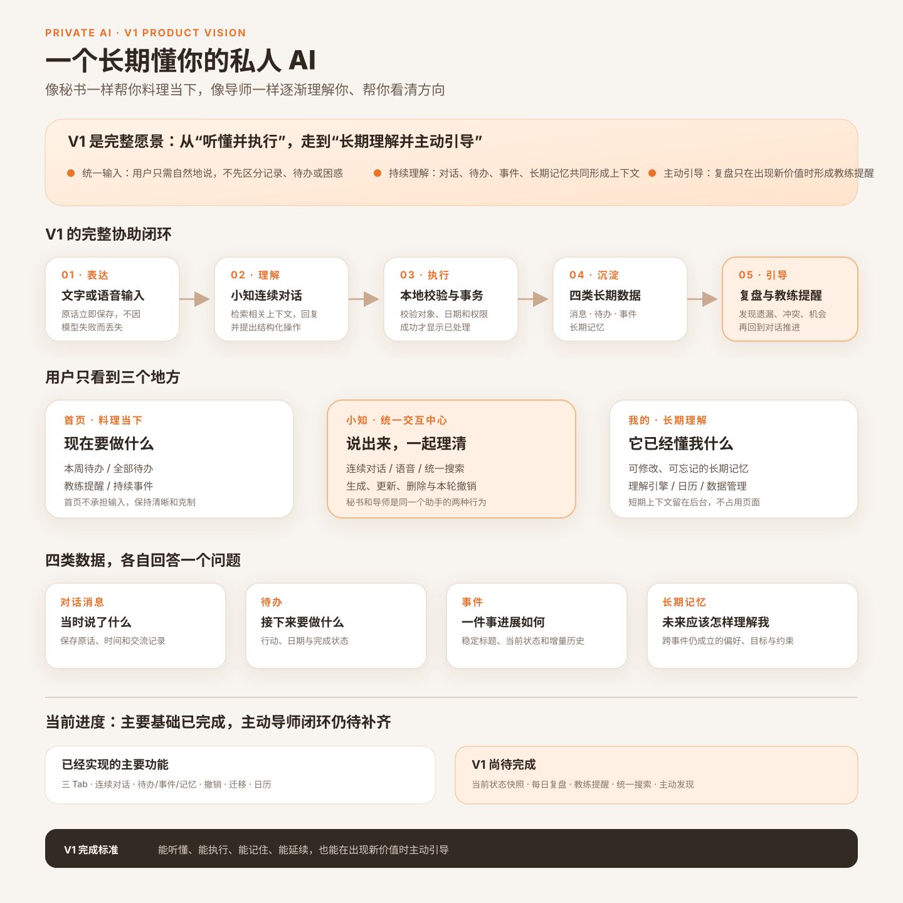

# 私人助手 V1 产品总纲

> 产品状态：V1 完整愿景已确认；当前已实现主要基础能力，主动导师闭环仍在建设中
>
> 最近更新：2026-09-25
>
> 平台：iPhone 优先（Expo / React Native）
>
> 产品一句话：一个长期懂你的私人 AI：像秘书一样帮你料理当下，像导师一样帮你看清方向。

## 1. V1 到底是什么

V1 不是一个增加了聊天页的备忘录，也不是只有输入和回复的通用聊天机器人。它要形成一条可以长期运转的私人协助闭环：

`自然表达 → 小知理解 → 安全执行 → 结构化沉淀 → 持续理解 → 复盘发现 → 回到对话推进`

用户只需要自然地说。系统保存完整表达，在合适时形成待办、事件和长期记忆；以后继续对话时能够延续这些上下文。每天复盘则负责发现遗漏、冲突、停滞、机会和反复模式，只有产生新价值时才在首页给出教练提醒。

“秘书”和“导师”不是两个机器人，也不是两个需要切换的模式：

- 秘书行为负责记录、安排、更新、查找和跟进当下事务。
- 导师行为负责连接历史、识别模式、提出问题和帮助用户看清方向。
- 两种行为都由“小知”通过同一条连续对话完成。

## 2. 版本口径

原“秘书 + 导师 V0.3”完整方案正式升级命名为 **V1 产品愿景**。V1 表示完整目标，不表示文档中的每项能力已经上线。

项目以后必须同时维护两种状态：

1. **V1 目标能力**：描述产品完整闭环应该具备什么。
2. **当前实现进度**：用“已实现 / 部分实现 / 未实现”说明手机当前版本真实具备什么。

不得因为代码已经是 `1.0.0` 就把未交付能力描述成已上线，也不得再用 V0.3 指代这套完整产品愿景。

## 3. 产品设计原则

1. **一个入口**：记录、事务和困惑共用“小知”输入框，不要求用户先分类。
2. **一种输出**：自然回复保持统一；数据变化通过紧凑的“已处理”回执说明。
3. **完整原话优先**：用户消息先保存，模型或网络失败不能导致表达丢失。
4. **四类数据分工**：消息、待办、事件和长期记忆独立保存，通过关系连接，不互相冒充。
5. **模型理解，本地执行**：模型提出回复和操作候选；本地代码负责权限、对象、日期、幂等、事务和撤销。
6. **主动但克制**：没有新信息、新机会或新判断时不重复提醒；首页提醒最多 5 条且不复述待办。
7. **长期理解可纠正**：长期记忆必须可修改、忘记、替代和撤销；推断性或敏感内容先确认。
8. **本地数据主权**：SQLite 是事实来源，导入导出可回查；摘要、快照和搜索投影均可重建。

## 4. 信息架构

### 4.1 首页：现在值得关注什么

首页负责行动和主动发现，不承担输入与资料库功能。

- **本周待办 / 全部待办**：默认展示本周；全部待办只展示本周以后的事项，避免重复。
- **教练提醒**：最多 5 条，只呈现遗漏、冲突、停滞、机会、关联或反复模式；每条说明原因。
- **事件列表**：持续事项的当前状态；置顶优先，其余按最新进展排序。

点击待办定位到对应待办分区；点击事件进入事件详情；点击教练提醒进入小知并携带必要上下文。

### 4.2 小知：统一交互与执行中心

小知保存一条连续、可回看的对话流。用户不创建、命名或切换会话，系统在后台按语义自动分段。

- 普通进入保持安静，不自动问候、不调用模型、不弹出键盘。
- 从事件、待办或提醒进入时携带上下文，在同一对话中继续处理。
- 文字和语音使用同一输入框；运行中仍可编辑下一段草稿，停止按钮只终止当前请求。
- 自然回复流式出现；业务操作只有在完整结构通过校验并成功提交后才显示“已处理”。
- 统一搜索入口覆盖对话、待办、事件和已生效长期记忆。

### 4.3 我的：它已经懂我什么

“我的”首先展示已生效的长期记忆，下方放置理解引擎、苹果日历、待办通知和数据管理。

- 一张记忆卡只表达一项稳定认知。
- 用户侧只显示类别、简短内容以及“修改 / 忘记”。
- 不展示证据、来源和置信度；这些只在后台用于冲突处理和解释。
- 不设置手动新增按钮；用户通过与小知对话表达“记住”。
- 短期状态不在页面展示，只参与当前上下文。

## 5. 四类一等数据

| 对象 | 回答的问题 | 保存内容 | 生命周期 |
|---|---|---|---|
| 对话消息 | 当时说了什么 | 原文、角色、时间、处理状态、后台分段 | 永久保留，除非用户删除 |
| 待办 | 接下来要做什么 | 行动、日期、完成状态、可见性 | 创建、修改、完成、删除、撤销 |
| 事件 | 一件事进展如何 | 稳定标题、当前状态、关键进展、关联待办 | 持续更新，进展只追加，关闭后保留历史 |
| 长期记忆 | 未来应该怎样理解我 | 偏好、目标、原则、约束、重要关系和反复模式 | 候选、生效、替代、忘记 |

同一条消息可以同时生成待办、更新事件并形成记忆候选，但三者职责不同：

- “下个月 11 号还款 10 万”可以形成待办，并更新“贷款偿还”事件。
- “我做重大决定前希望先看最坏情况”可以成为长期记忆。
- 完整表达仍留在对话消息中，不复制成三份相同文本。

## 6. 关键产品链路

### 6.1 普通对话与结构化执行

1. 用户消息立即保存并显示。
2. 系统先提供最近对话、相关历史段和最小对象指针；模型按需调用本地只读工具取得事件、待办和长期记忆的真实状态。
3. 读取循环有明确轮次与数量上限；额度用尽时进入无工具收敛轮，并说明仍未核实的部分。
4. 模型基于已经读取的事实生成自然回复与结构化操作候选。
5. 本地校验协议、精确读取集合、对象 revision、日期、权限、记忆准入和幂等键。
6. 有效操作、关系、决策日志和助手消息按各自事务边界保存；最终回执只基于真实执行结果生成。
7. 页面流式展示回复，并用一张紧凑回执显示真正完成的变化。
8. 用户可以撤销本轮已提交操作；停止未完成请求时不提交业务变化。

若行动明确但没有日期，可以先保存隐藏待办，并在当前对话最多追问一次时间；用户不回答时不阻塞其他对话。

### 6.2 事件持续更新

模型对每次相关输入生成完整事件增量判断：

- 是否属于已有事件、新事件或仅是一条独立消息。
- 是否需要更新当前状态。
- 是否出现值得追加的关键进展。
- 是否同时创建、修改或删除关联待办。

事件标题保持稳定；当前状态更新为最新快照；关键进展只追加有意义变化，不覆盖历史消息。

### 6.3 长期记忆准入

- 用户明确要求记住的稳定、非敏感信息可以直接生效并给出可撤销回执。
- 信息明确、稳定、非敏感且多次重复出现时可以自动生效。
- 单次推断、冲突认知和敏感内容先等待确认。
- 新认知不能静默覆盖旧认知；明确纠正时建立替代关系。

### 6.4 每日复盘与教练提醒

系统每天至多完成一次幂等复盘，不要求用户当时停留在首页：

1. 当前状态快照汇总近期消息、进行中事件、未完成待办和相关长期记忆。
2. 没有结构化变化时本地跳过，不调用模型。
3. 有变化时模型寻找遗漏、冲突、停滞、机会、关联和反复模式。
4. 本地执行证据、增量价值、去重和数量校验。
5. 最多保存 5 条教练提醒，并预先生成“背景 + 一个推进问题”。

提醒只在首页出现，不主动发送系统推送。用户点击后进入小知继续处理；“不再提醒”只抑制该提醒及其等价重复，不删除原事件、待办或消息。未解决事项只有出现新信息、新机会或新判断时才再次提醒。

### 6.5 统一搜索

精确搜索完全在本地执行，不调用模型。顶部提供“全部 / 事件 / 对话 / 待办 / 记忆”筛选。

- 确有关联的事件、待办和消息组成一个事件组。
- 跨事件仍成立的长期记忆独立展示。
- 没有关系的同词命中保持独立，不能只靠关键词强行合并。
- 需要归纳、回忆或追问时，用户直接在小知中自然提问。

## 7. 模型与本地代码的职责

### 模型负责

- 理解用户表达和对话上下文。
- 判断一次性行动、持续事件、事件归属和长期记忆候选。
- 解析自然语言日期并提出结构化操作。
- 生成自然回复、事件增量判断和教练候选。
- 在允许时决定是否使用 DeepSeek 服务端联网搜索，并基于返回来源回答。

### 本地代码负责

- 验证结构格式、对象 ID、日期合法性、权限和业务约束。
- 保证幂等事务、失败回滚、操作回执和本轮撤销。
- 保存决策日志，记录候选、拒绝原因和提交结果。
- 执行精确搜索、排序、筛选、通知、日历同步和数据导入导出。
- 限制联网搜索轮为只读，校验并保存可安全展示的来源链接。

模型返回格式失败时，可以重新发起一次完整请求；不能再调用模型只做“修 JSON”。两次都失败时保留用户消息并提供重试，不创建对象，也不显示虚假成功。

## 8. 上下文与 Token 原则

- 完整消息永久保留；模型上下文不是数据库全量复制。
- 上下文选择由最近对话、当前段摘要、相关历史段和少量相关结构化对象组成。
- 后台会话摘要只服务模型，不在用户界面展示，并且可由原始消息重建。
- 精确搜索、对象排序、状态机和事务校验不使用模型。
- 分段摘要、当前状态快照和每日复盘只在内容发生实质变化时更新。
- 一条用户消息使用有界的模型与工具循环；避免无必要的重复读取、重复搜索和额外总结调用。

## 9. 数据、隐私与迁移

- SQLite 是本地事实来源；LLM Key 只保存在本机。
- 导出文件包含用户内容和可恢复数据，不包含密钥。
- 旧版原声按时间戳导入为用户消息；旧待办导入待办；旧主题导入事件。
- 迁移只新增结构和映射，不在验收前删除旧来源。
- Dev 与 Release 使用不同 Bundle ID 和独立数据库；覆盖安装同一 Release Bundle ID 保留生产数据。

## 10. V1 能力范围与当前进度

当前进度以 2026-09-25 已合并到 `main` 并完成对应 Dev 验收的能力为准；是否已安装到生产手机必须以对应 Release 记录为准。

| V1 能力 | 状态 | 当前说明 |
|---|---|---|
| 首页 / 小知 / 我的三 Tab | 已实现 | 主要页面与导航已上线 |
| 连续对话、消息保存与后台分段 | 已实现 | 支持历史恢复、有界上下文和相关段检索 |
| 流式回复、运行中草稿与停止 | 已实现 | 停止不提交未完成操作 |
| 模型操作协议、本地校验、事务与决策日志 | 已实现 | 支持失败重试和结构化审计 |
| 按需读取真实对象与写前 revision 校验 | 已实现 | 支持消息、事件、待办和记忆的搜索、读取与列表工具 |
| 待办生成、日期判断、完成、删除与撤销 | 已实现 | 本周与本周以后分区展示 |
| 事件创建、增量更新、详情、关联待办与删除 | 已实现 | 当前状态更新、关键进展追加 |
| 长期记忆准入、展示、修改和忘记 | 主要实现 | 已有明确准入和管理；冲突确认仍需持续强化 |
| DeepSeek 原生联网搜索 | 已实现 | 可关闭；联网轮只读，来源随消息持久化 |
| Markdown 回复、推理过程与移动端输入状态 | 已实现 | 支持安全 Markdown、思考折叠、置底和键盘跟随 |
| 旧数据迁移与完整备份 V3 | 已实现 | 覆盖对话、待办、事件、关系、回执、记忆和搜索来源 |
| 苹果日历与待办通知 | 已实现 | 属于秘书侧执行能力 |
| 操作关系和级联删除 | 部分实现 | 待办/事件删除已覆盖；复杂来源关系仍需统一状态机 |
| 当前状态快照 | 未实现 | 尚未形成可重建的统一快照层 |
| 每日复盘 | 未实现 | 尚无后台幂等运行与补跑机制 |
| 首页教练提醒 | 未实现 | 首页当前只有待办和事件 |
| 统一搜索 | 未实现 | 尚无覆盖四类对象的统一入口 |

## 11. V1 完成标准

1. 用户无需选择模式即可输入记录、事务或困惑，消息重启后仍完整存在。
2. 一次输入可以同时形成多个对象，但只显示一张合并回执；重试不重复创建。
3. 有日期待办进入正确分区；无日期行动被保存并最多追问一次时间。
4. 持续事项正确创建或更新事件；标题稳定、状态更新、关键进展只追加。
5. 长期记忆遵守分级准入，可修改、忘记、替代和撤销。
6. 普通进入小知保持安静；从待办、事件或提醒进入时能恢复来源上下文与原滚动位置。
7. 模型、网络和事务失败不丢用户原话、不产生虚假对象、不显示虚假成功。
8. 当前状态快照可重建，数据无变化时每日复盘不调用模型。
9. 首页最多展示 5 条不重复待办的教练提醒；每条有原因，可处理或不再提醒。
10. 提醒点击后回到同一连续对话；未解决事项仅在产生新价值时再次出现。
11. 统一搜索覆盖四类对象，相关结果正确归组，无关同词结果不误合并。
12. 旧数据可回查，Release 覆盖安装保留生产数据，完整 `npm run ci` 通过。

V1 真正完成的判断不是“版本号已经到 1.0.0”，而是：**能听懂、能执行、能记住、能延续，也能在出现新价值时主动引导。**

## 12. 非目标

V1 不包含云端账号与多端同步、外部系统自动代办、多个助手人格、秘书/导师模式开关、复杂知识图谱、社交功能或无依据的高频主动推送。需要服务端准点调度的能力，在有明确必要前不引入。
