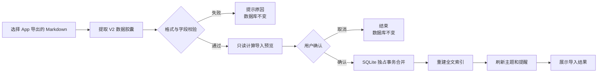

# 可导入 Markdown 备份设计

日期：2026-09-04
状态：已确认并完成实现，等待真机验收

## 1. 背景与目标

当前「我的 → 导出数据」会生成一份便于阅读的 Markdown，并通过系统分享面板保存或发送。项目曾用一份人工整理的导出内容完成过新旧 Bundle ID 迁移，但现有 App 没有面向用户的通用导入入口；当前 Markdown 也没有格式版本、稳定记录 ID、更新时间及其他完整恢复字段，因此不能安全地自动解析并合并到已有数据库。

本次范围收紧为：不接入 iCloud、不做后台或自动同步；只保证由本 App 新版本导出的 Markdown，可以由本 App 重新选择并导入。导入既支持空数据库恢复，也支持与已有数据合并。

目标：

- Markdown 保持适合人直接阅读。
- App 导出的文件携带完整、稳定、可校验的机器数据。
- 导入已有数据库时幂等，不重复创建记录。
- 同一记录发生冲突时，数据版本时间 `revisionAt` 更新的一方胜出，并保留被覆盖版本。
- 文件无效或导入失败时，不污染现有数据库。

非目标：

- 不支持任意 Markdown 或用户自行编写的 Markdown。
- 不做 iCloud、网盘、后台任务或多端实时同步。
- 导入文件缺少某条记录时，不推断该记录已被删除。
- 不导出或恢复 LLM API Key。

## 2. 页面与交互

「我的」页面在现有「导出数据」下增加「导入数据」入口：

```text
┌────────────────────────────────┐
│ 导出数据          Markdown  ⤴ │
├────────────────────────────────┤
│ 导入数据          选择文件  › │
└────────────────────────────────┘
```

点击「导入数据」后，通过系统文件选择器选择 `.md` 文件。解析和校验完成后展示确认弹窗：

```text
┌────────────── 导入预览 ──────────────┐
│ 备份时间：2026-09-04 21:30           │
│                                      │
│ 新增  12 条                          │
│ 更新   3 条                          │
│ 忽略  47 条                          │
│ 冲突   1 条（将保留历史版本）        │
│                                      │
│ 本地已有内容不会因备份缺失而删除。   │
│                        取消  确认导入 │
└──────────────────────────────────────┘
```

导入完成后展示结果；若数据已写入但个别通知重建失败，则提示“记录已导入，部分提醒将在下次启动时补建”，不回滚已经成功的数据导入。

## 3. 导出文件格式

新格式标识为 `assistant-app-export-v2`。文件前半部分继续输出当前的人类可读 Markdown；文件末尾增加一个 HTML 注释形式的机器数据胶囊。Markdown 阅读器默认不显示注释，App 导入时只读取数据胶囊，不反向解析展示文案。

示意：

```markdown
# 我的个人助手记录

## 待办 · 2026/9/4 10:00:00

> 周六预约牙医

主题：健康管理

---

<!-- ASSISTANT_APP_EXPORT_V2
{"format":"assistant-app-export-v2","schemaVersion":2,"exportedAt":1788514200000,"entryCount":1,"payload":{"entries":[...]}}
ASSISTANT_APP_EXPORT_END -->
```

机器数据至少包含：

- `format`、`schemaVersion`、`exportedAt`、`entryCount`。
- `entries` 的完整字段：`id`、原文、类型、标题、时间、提醒时间、主题、标签、人物、理解状态与来源、纠正快照、创建/更新时间、数据版本时间、完成状态与时间、输入来源。
- `profile`：姓名、目标、规避事项、晨晚提醒开关。
- `topicPreferences`：主题及置顶时间。

`settings` 不进入备份，避免导出 LLM Key；LLM 开关、服务地址和模型也沿用导入设备的本地配置。

为避免原文中出现 Markdown 注释结束符破坏数据胶囊，序列化时必须对 JSON 内的连续连字符进行安全转义。导入端以首尾固定标记提取胶囊，并依次校验 JSON、格式名、版本、条数和必填字段。

## 4. 数据流与合并规则



条目合并规则：

1. 本地不存在相同 `id`：新增。
2. 本地存在相同 `id`，全部业务字段一致：忽略。
3. 两边不同，导入记录 `revisionAt` 更晚：导入记录覆盖本地记录；覆盖前把本地完整快照写入冲突历史。
4. 两边不同，本地记录 `revisionAt` 更晚：保留本地记录；把导入记录写入冲突历史。
5. 两边不同但 `revisionAt` 相同：本地版本胜出，两份内容都进入冲突结果，避免静默覆盖。
6. 文件中重复出现相同 `id`：整个文件校验失败，不进入写事务。

因此，同一个备份重复导入时会全部进入“忽略”，具备幂等性。导入文件中不存在的本地条目一律保留；这是一项恢复/迁移能力，不承担删除同步。

画像合并规则：空数据库或本地画像仍为默认值时，恢复文件中的画像；本地已经有非默认画像时默认保留本地画像，并在预览中说明“画像未覆盖”。主题置顶采用同名主题 `pinnedAt` 较新的值。

## 5. 数据库与组件调整

建议增加 `import_conflicts` 表，字段包括：

- `id`：冲突记录 ID。
- `entry_id`：关联条目 ID。
- `local_snapshot`、`incoming_snapshot`：两侧完整 JSON。
- `winner`：`local` 或 `incoming`。
- `reason`：`newer_updated_at` 或 `same_timestamp`。
- `imported_at`、`source_exported_at`。

同时为 `entries` 增加内部字段 `revision_at`。现有 `updated_at` 已被产品定义为“用户最后修改标题/内容的时间”，不能改成泛化的数据同步时间；而 LLM 回填、完成状态、主题合并等操作目前不会统一更新它。`revision_at` 专门用于备份冲突判断：旧数据用 `updated_at` 回填，此后所有会改变导出内容的写操作都更新 `revision_at`，界面仍继续展示原有 `updated_at` 语义。

新增模块职责：

- `src/engine/backup-format.ts`：构建/解析 V2 Markdown、结构校验。
- `src/engine/import-merge.ts`：无写入地计算新增、更新、忽略、冲突。
- `src/db.ts`：事务导入、冲突快照和主题偏好恢复。
- `app/(tabs)/profile.tsx`：文件选择、预览确认和结果反馈。

系统文件选择使用 Expo SDK 57 的 `expo-document-picker`，选择后复制到 App 缓存再读取。导入完成或失败后，不依赖缓存文件继续运行。

## 6. 兼容与迁移策略

- 新版 V2 Markdown：保证完整导入。
- 当前没有数据胶囊的旧 Markdown：第一版不承诺自动导入，明确提示“这是旧版导出文件，缺少完整恢复信息”。
- 现有启动时 `migrateLegacyOnce` 的五条硬编码迁移保留，不与用户导入入口混用。
- 数据库新增表采用 `CREATE TABLE IF NOT EXISTS`，不破坏现有真机数据。
- 导出展示区保持现有文案结构，减少用户阅读体验变化。

## 7. 异常与边界

- 文件不是本 App 导出、版本过新、JSON 损坏、必填字段缺失：拒绝导入。
- 文件过大：读取前检查大小并设置上限，避免内存峰值导致 App 退出。
- 时间戳、枚举、数组类型非法：拒绝导入，不尝试猜测。
- 事务执行失败：整体回滚；FTS 在同一事务内重建，提醒在主数据提交后处理。
- 导入过程中退出 App：未提交事务不保留；已提交的数据可在下次启动补建索引和提醒。
- 旧备份包含本地已经删除的记录：会作为缺失 ID 新增，这是备份恢复的预期行为。
- 导入不会调用 LLM，避免内容、标题或主题在恢复时发生二次变化。

## 8. 验收标准

- 新版 App 导出的 `.md` 能被同版本 App 选择并导入。
- 空库导入后，条目字段、主题聚合、完成状态和提醒时间与导出前一致。
- 有数据时能准确展示新增、更新、忽略和冲突数量。
- 同一文件连续导入两次，第二次不新增或更新任何条目。
- 相同 ID 冲突按内部 `revisionAt` 决定胜者，并保留完整冲突快照；界面展示的 `updatedAt` 语义不变。
- 无效、损坏或版本不支持的文件不会修改数据库。
- LLM Key 不出现在导出文件中。
- 导入过程不调用 LLM。
- TypeScript 类型检查、格式解析单测、合并规则单测、事务回滚测试通过。
- 真机完成“导出 → 新增/修改本地记录 → 导入 → 核对预览与结果”的手工验收。

## 9. 实施与回滚

设计确认后，从 `main` 创建 `codex/importable-markdown` 分支，通过一个独立 PR 交付。实现顺序：文件格式与单测 → 数据库事务合并 → 文件选择与交互 → 真机验收说明。

回滚代码时可回退该 PR。新增的 `import_conflicts` 表为向后兼容的独立表，旧版本不会读取它，无需执行破坏性降级迁移。
