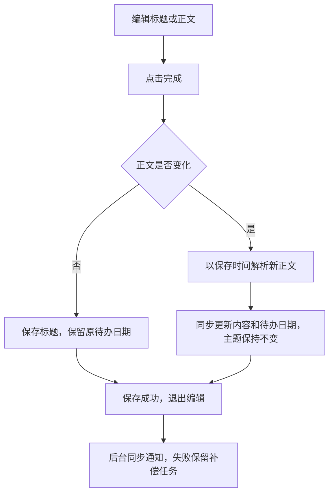

# 第二批：日期与编辑一致性方案

状态：用户已确认；在 codex/entry-consistency 实现，待真机验收。

## 范围

修复跨天补理解日期漂移、异步结果覆盖人工编辑、正文日期修改不更新待办、中断 pending 无恢复。沿用现有详情页布局和完成按钮。

## 数据流与决策

1. 首次理解与失败重试都以记录 createdAt 为时间基准；人工正文修改以这次保存时间为新基准。重试不能把“明天”解释成重试当天的明天。
2. 请求发出时保存记录版本，回填使用 SQL 条件更新并检查影响行数。人工编辑、主题重命名、删除或更新版本后，旧结果不得写入；失败降级同样执行条件更新，不能无条件覆盖状态。
3. 模型接收准确参考日期及本地算出的任务日期。标题和待办日期依据同一计算结果；模型返回的具体日期不能仅靠替换相对词保证正确，需验证日期一致性。
4. 只编辑标题：保留用户输入及原待办时间。编辑正文：同步提取时间；明确删除时间时清除旧 dueAt/remindAt。正文仍是行动意图时保留 task，否则重新归类。聚合主题和用户手工编辑的标题保持不变；未改标题时从新正文生成规则标题。
5. 编辑已完成记录保留完成状态，不擅自重新打开待办。记录保存、FTS 更新和通知补偿意图应在同一事务完成。
6. 启动恢复 failed 与上次中断的 pending；同一记录不并发理解，补理解采用有界并发，避免同时发出 50 个请求。页面可见时在结果落库后刷新，并保留当前搜索条件。

## 可见流程

## 验收

- 9 月 5 日输入“明天买牛肉”，9 月 6 日重试仍为 9 月 6 日。
- 模型未返回时手工改标题或主题，返回后修改不被覆盖。
- 正文“9月6日买牛肉”改为“9月7日买牛肉”，待办时间同步，主题不变。
- 正文删除日期后不残留旧提醒；仅改标题不重新计算日期。
- 已完成记录编辑后仍保持完成。
- 理解中关闭 App，重开后能恢复，不重复执行同一条。
- 故障注入：数据库写失败不出现部分保存；通知失败不影响成功保存。

## PR 与回滚

从已合并 PR #9 的 main 新建 codex/entry-consistency 分支。必要的模型结果写入条件使用现有 revisionAt 加状态/原文保护，并验证同毫秒变化；若需独立请求版本字段，先记录向后兼容迁移。通过独立 PR 交付，手机 Reload 验收，不自动合并。

下一批保留：移除个人种子迁移、按主题聚合后分页、全局搜索状态一致性及通知删除补偿。

## 实现与验证说明

- 无新增 schema。回填 SQL 检查 revisionAt、rawText 和非 manual 状态；本批相关本地修改使用 MAX(revision_at+1, 当前时间)，避免同毫秒变化被遗漏。
- 模型失败时规则数据与 failed 状态在一次条件更新中落库，避免另一次状态更新污染新编辑。
- 正文和派生待办字段、FTS、通知补偿在独占事务内保存；完成状态与主题不改动。标题是否手工改变以本次提交和保存前标题比较，不增加跨历史版本的标题来源字段。
- pending/failed 启动时最多取 50 条串行恢复；运行中的同一记录共享任务。每次结束触发前台刷新，首页保持两种搜索文本并丢弃过期查询响应。
- 集成测试用 Node 内存 SQLite 执行真实 db.ts/understand.ts，模拟模型延迟；不修改用户数据库。覆盖错误日期、编辑竞争、同条去重、事务回滚及中断恢复。
- 原生 SQLite、键盘交互和真机搜索仍需设备验收；后台批次超过 50 条的分页恢复保留后续优化。
