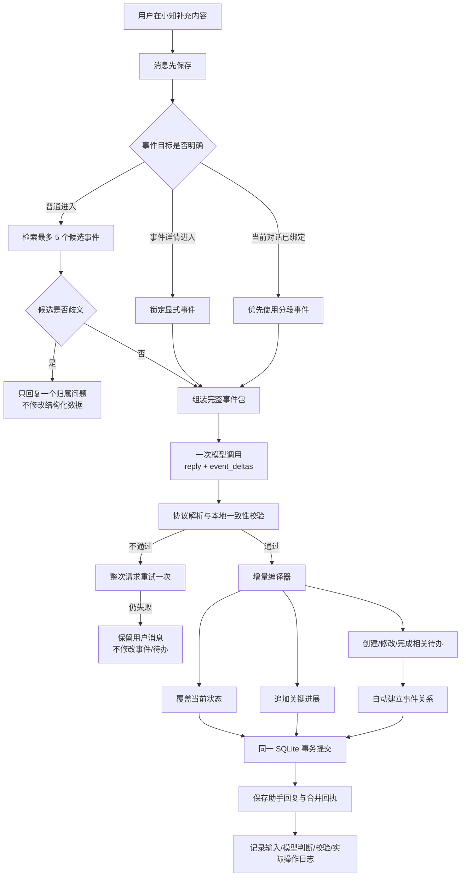

# Existing Event Delta Decision Design

状态：协议已确认，代码已实现，等待 Dev 端验收

## 1. 目标

当用户继续谈一个已有事件时，小知应在一次模型调用中完成一份事件级增量判断，然后由本地代码一致地更新：

- `当前状态`：可覆盖的事件现状快照；
- `关键进展`：只追加的有意义变化历史；
- `相关待办`：拥有独立生命周期、与事件建立关系的行动对象。

三个结果不是互斥项，也不要求每轮全部变化。完整性来自“一次判断、统一校验、统一投影”，而不是让模型分别、无关联地提出多个数据库操作。

## 2. 数据流



## 3. 提供给模型的完整事件包

每个允许修改的事件必须提供：

- 事件 ID、稳定标题、当前状态、版本号；
- 最近 3–5 条未撤销关键进展；
- 全部未完成相关待办，以及最近完成的相关待办；
- 每条待办的 ID、标题、日期、时间精度、完成状态和更新时间；
- 本轮用户原话、消息时间、时区；
- 进入来源：事件详情、分段延续或语义检索；
- 允许引用的候选事件和候选待办 ID。

显式从事件详情进入时，事件 ID 直接锁定。普通对话只允许模型从本地召回的候选中选择；两个候选接近时不静默合并，回复一个必要问题，`event_deltas` 为空。

当前实现只把相关待办文本拼入事件候选，不能稳定支持改期或完成。实现时应补充完整待办身份、日期与状态。

## 4. 模型输出协议

自然回复、会话分段和结构化判断仍由同一次请求返回。每个事件最多产生一个完整增量对象：

```json
{
  "reply": "好，我记下了，下一笔计划是下个月11号还10万。",
  "segment": {
    "action": "continue",
    "summary": "用户已提前还款30万，并计划10月11日继续还款10万"
  },
  "event_deltas": [
    {
      "key": "loan-update-1",
      "target": {
        "action": "update_existing",
        "event_id": "event_loan"
      },
      "evidence": ["下个月11号再还10万"],
      "state": {
        "action": "replace",
        "change_type": "plan",
        "value": "已提前还款30万，剩余约30多万；计划10月11日再还10万"
      },
      "progress": [
        {
          "type": "decision",
          "content": "确定下一笔还款安排：10月11日还款10万"
        }
      ],
      "todos": [
        {
          "action": "create",
          "todo_ref": "todo_1",
          "text": "还款10万",
          "date_status": "resolved",
          "date_text": "下个月11号",
          "due_date": "2026-10-11",
          "time_precision": "date"
        }
      ]
    }
  ]
}
```

### 字段规则

- `target.action`：`update_existing | create_new | none | clarify`。已有事件场景通常为 `update_existing`。
- `evidence`：只能引用本轮用户原话中的证据，不允许把助手建议或历史推断当成新的行动承诺。
- `state.action`：`keep | replace`。`replace` 必须给出合并旧状态后的完整新快照，不是只抄本轮原话。
- `state.change_type`：`fact | decision | result | blocker | plan | correction`，用于日志和测试，不直接展示。
- `progress`：0–2 条，类型同上；记录这次新增了什么，不复述整个当前状态。
- `todos.action`：首版为 `create | update | complete`。创建使用本轮局部引用，修改或完成必须使用候选待办 ID。
- 新建或修改的待办属于该事件时，由本地增量编译器自动建立关系，模型不再单独输出 `link_todo_event`。

用户明确取消行动不能被伪装成完成。当前待办只有完成/未完成，`cancel` 暂不进入本轮协议；在待办状态模型扩展前，事件状态和进展可以记录“计划取消”，但系统应明确说明原待办仍需用户处理，不能静默篡改。

## 5. 判断矩阵

| 用户表达 | 当前状态 | 关键进展 | 相关待办 |
|---|---|---|---|
| 新计划“11号还10万” | 合并为完整新状态 | 追加决定 | 新建并关联 |
| 改期“改到20号还” | 更新下一步 | 追加变更 | 修改匹配待办 |
| 已完成“今天已经还了” | 更新结果与剩余状态 | 追加结果 | 完成唯一匹配待办 |
| 新阻碍“银行暂时不允许提前还” | 更新阻碍 | 追加阻碍 | 不一定变化 |
| 补充重要历史事实 | 仅在仍影响现状时更新 | 追加事实或纠正 | 通常不变 |
| 未确认建议或提问 | 不变 | 不追加 | 不创建 |
| 重复表达、寒暄 | 不变 | 不追加 | 不变化 |

一致性约束：

1. 用户新信息导致当前状态变化时，原则上必须有一条对应关键进展。
2. 关键进展可以单独追加，例如补充一项重要历史事实，但不得与当前状态或最近进展同义重复。
3. 待办发生创建、改期或完成时，必须有对应关键进展；若它改变下一步，也必须反映在当前状态中。
4. 用户只是在讨论可能性，或建议尚未被接受时，不能创建待办。
5. 一个已有行动只是改期或改内容时必须更新原待办，不能创建语义重复项。

## 6. 本地校验与增量编译

本地校验只约束安全性和一致性，不用确定性关键词替代模型语义判断：

- 目标事件、待办必须来自允许候选或本轮局部引用；
- `evidence` 规范化后必须能在本轮用户消息中定位；
- 新状态不能为空、必须与旧状态有实质差异；
- 进展与当前状态、最近进展去重；
- 日期协议与日历日期必须有效，模糊日期不得猜测；
- 待办的创建、更新、完成目标必须唯一；
- 检查上述状态、进展、待办联动约束。

通过后，增量编译器产生现有原子操作：

```text
state.replace       -> update_event
progress.append     -> append_event_update
todo.create         -> create_todo + 自动 link_todo_event
todo.update         -> update_todo + 确保 link_todo_event
todo.complete       -> complete_todo + 确保 link_todo_event
```

全部操作、助手回复和会话摘要在一个 SQLite 事务中提交。`event_delta.key` 不要求模型生成，由协议层按数组顺序生成；再以 `request_id + 本地 event_delta.key + 子项序号` 生成稳定操作键。重试不得重复追加进展或待办，事件 revision 继续做乐观并发校验。

## 7. 失败与降级

- JSON 或协议不合法：完整模型请求重试一次，不进行“只修 JSON”的第二次调用。
- 第二次仍失败：用户消息已经保存；事件、进展和待办全部不变；页面提供局部重试。
- 事件归属歧义：不写结构化数据，只追问一个必要问题。
- 待办目标歧义：允许先提交明确的事件状态与进展，但不修改不确定待办；回复中只追问待办所需信息。
- 日期含糊：可创建无日期隐藏待办，并在自然回复中轻量追问时间；不得猜日期。
- 事务中任一操作失败：整组结构化变化及助手回复回滚，用户消息保留为待重试状态。

## 8. 回执与日志

用户只看到按事件合并的一张回执，例如：

> 已更新“公积金贷款还款” · 追加 1 条进展 · 建立 1 项待办

决策日志保存：事件包引用、原始 `event_deltas`、协议解析结果、本地拒绝原因、编译后的操作、实际提交 ID、模型耗时与 Token。日志不在普通用户页面展示。

## 9. 实现范围

1. 新增事件增量 schema、解析器、类型和 prompt 版本。
2. 扩展事件上下文，提供完整关联待办身份、日期和状态。
3. 新增事件增量校验器与编译器，替换已有事件场景下散列操作的直接提交。
4. 沿用现有事件/待办原子 store、事务、撤销、回执和决策日志。
5. 不新增模型调用，不改变页面布局，不增加原生依赖。
6. 待办取消状态不在本轮实现，但不得把取消错误映射为完成。

## 10. 验收标准

1. 已有事件中输入新计划，同时更新完整当前状态、追加关键进展、创建并关联待办。
2. 已有待办改期时只更新原待办，不产生重复待办。
3. 表达已完成时，在唯一匹配下更新状态、追加进展并完成待办。
4. 外部可能性、提问、寒暄和重复表达不生成待办或噪声进展。
5. 显式事件入口始终更新指定事件；普通入口归属歧义时不静默修改。
6. 状态更新不能丢掉仍有效的关键事实；进展只描述本轮新增变化。
7. 模糊日期不猜测；无日期待办沿用隐藏与追问规则。
8. 同一请求重试不会重复写状态、进展、待办或关系。
9. 任何子操作失败时不产生半套事件结果。
10. 决策日志可以还原模型判断、拒绝原因和最终提交结果。
11. 新测试覆盖新计划、改期、完成、阻碍、可能性、重复、歧义、无日期、重试幂等和事务回滚，并加入 `npm test`；`npm run ci` 必须通过。
