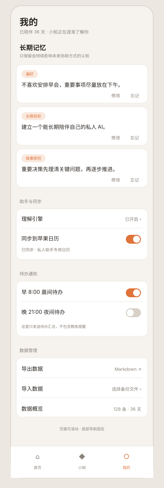
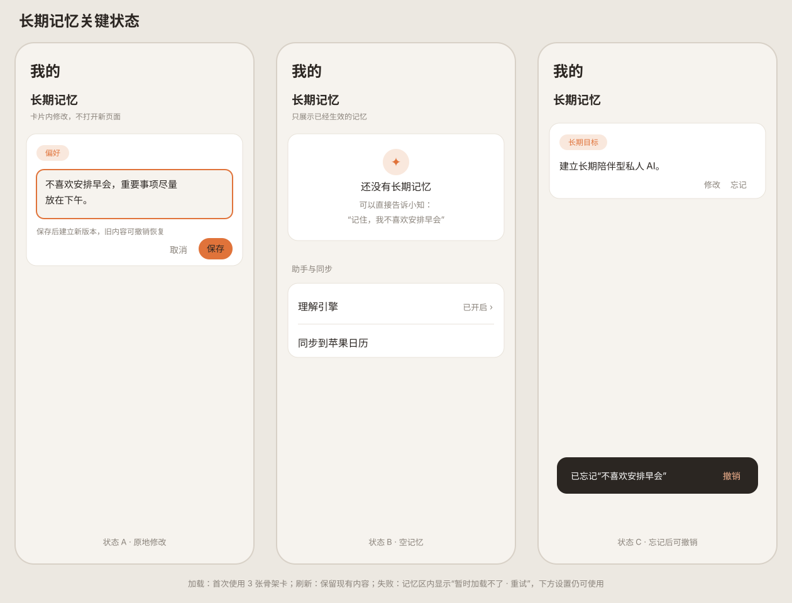
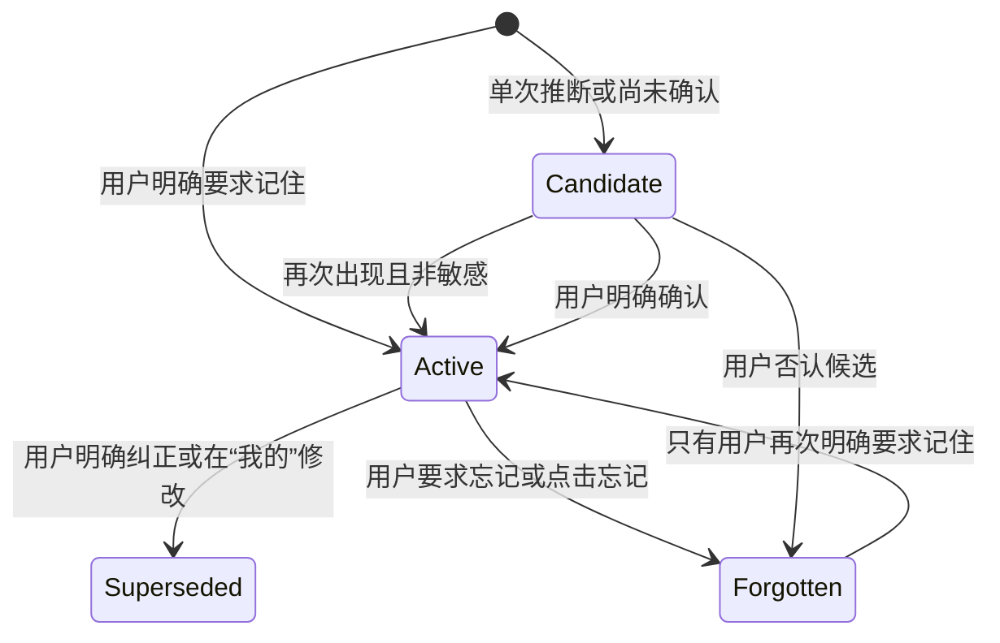
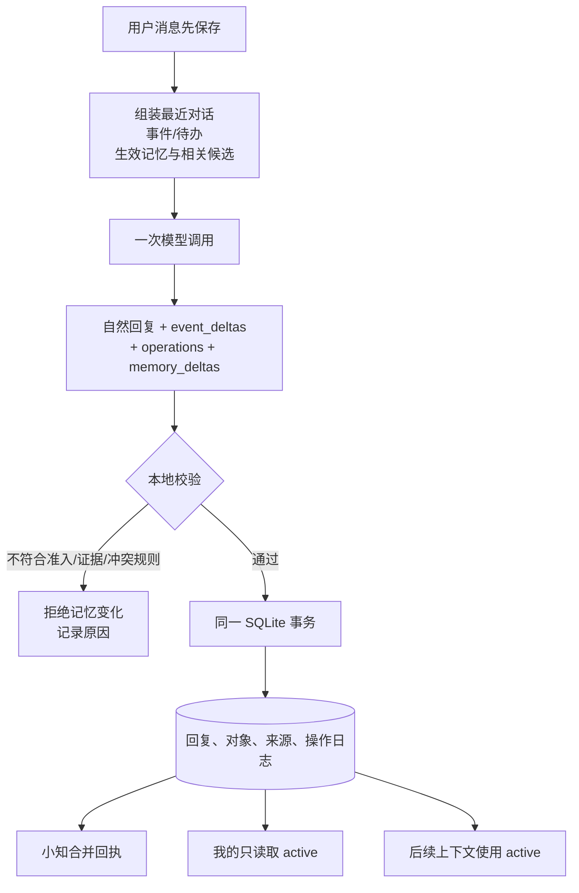

# 长期记忆最小闭环设计

状态：用户已确认（2026-09-15），进入实现阶段

产品目标：让小知保存“关于用户、跨事件仍然成立、会影响未来协助方式”的认知，并让用户能在“我的”中看见、纠正和忘记。

## 1. 范围

本阶段交付一个完整闭环，而不是单独增加记忆列表：

1. 小知在现有单次模型调用中同时判断自然回复、待办、事件和长期记忆，不新增每轮模型调用。
2. 记忆分为后台候选和已生效记忆；“我的”只展示已生效记忆。
3. 已生效记忆进入后续小知上下文，真正改变未来回答和安排。
4. 小知保存、替代或忘记记忆时显示合并回执，并接入现有整轮撤销。
5. “我的”支持逐卡修改、忘记和短时撤销，不提供手动新增入口。
6. 旧画像退出用户界面；旧数据保留作回滚来源，并按保守规则迁移。
7. 新备份包含长期记忆；旧备份和旧日志继续可导入。

本阶段不做：可见短期记忆、复杂知识图谱、自动人物档案、跨设备同步、记忆搜索、教练提醒、来源展示，以及删除原始对话时的级联 UI。统一搜索和教练提醒留到后续阶段。

## 2. “我的”完整信息结构与页面线框

```text
我的
├── 陪伴摘要：陪伴天数 + 已保存内容数量
├── 长期记忆（主内容）
│   ├── 生效记忆卡：类别 + 内容 + 修改 + 忘记
│   ├── 原地编辑态
│   ├── 空态 / 首次加载 / 区域错误态
│   └── 忘记后的临时撤销提示
├── 助手与同步
│   ├── 理解引擎：状态 + 二级配置入口
│   └── 苹果日历：开关 + 同步状态 / 错误处理
├── 待办通知
│   ├── 早 8:00 晨间待办
│   ├── 晚 21:00 夜间待办
│   └── 说明：不包含教练提醒
├── 数据管理
│   ├── 导出数据
│   ├── 导入数据
│   └── 数据概览：总数 + 陪伴天数
└── 固定底部导航：首页 / 小知 / 我的
```





页面规则：

- 顶部统一改为“我的”，不再使用“主人”；陪伴摘要只保留陪伴天数和内容数量，不承担画像功能。
- “长期记忆”置于设置之前，是页面主体。
- 一张卡只表达一项认知，显示类别、简短内容、“修改 / 忘记”。
- 不显示依据、来源、置信度、内部状态或创建时间。
- 修改采用卡片内原地编辑，只允许修改内容；保存后旧版本转为 `superseded`。
- 忘记后卡片立即移出，并显示“已忘记 · 撤销”的临时反馈。
- 空态使用：“还没有长期记忆。可以直接告诉小知：记住……”；不自动填充推断。
- 原画像卡移除；理解引擎和日历合并为“助手与同步”，晨晚待办通知单列，导入导出与统计合并为“数据管理”。
- 页面整体滚动、底部 Tab 固定。重新聚焦时保留已渲染内容和滚动位置，在后台刷新，不使用整页 Loading。
- 首次加载只在记忆区显示 3 张骨架卡；记忆加载失败只影响记忆区，下方设置仍可使用。
- 教练提醒仍只在首页展示且不主动推送；这里的晨晚开关仅控制现有待办汇总通知。

## 3. 记忆边界与类别

允许进入长期记忆的内容必须同时满足：

- 关于用户，而不是通用知识或他人的临时情况；
- 跨越当前事件仍可能成立；
- 会影响未来的建议、安排、表达或判断。

首版固定五类：

| 类别 | 例子 | 不应进入的内容 |
|---|---|---|
| 偏好 | 不喜欢早会 | 今天不想开会 |
| 做事原则 | 重要决策先理清关键问题 | 这次先等等 |
| 长期目标 | 建立长期陪伴型私人 AI | 下周交材料 |
| 重要关系 | 女儿上小学，安排需避开接送时间 | 同事今天请假 |
| 反复模式 | 压力大时容易推迟财务整理 | 单次忘记还款 |

完整对话、事件进展、待办、短期状态、账号密码、验证码、证件号和完整金融账号不得作为长期记忆保存。

## 4. 准入状态机



准入规则：

1. 用户明确说“记住 / 以后按这个来”等，且不包含禁止保存的信息：直接 `active`。
2. 单次推断：保存为 `candidate`，不进入“我的”，也不得作为事实影响回答。
3. 同一项候选在不同用户消息中再次出现：模型判断语义一致，本地校验至少两个不同来源；非敏感时可自动生效，并在当轮提示“我记住了”。
4. 候选确实会影响当前或近期协助时，小知可以顺势问一次确认；否则安静等待，不打断对话。
5. 敏感认知不能仅靠重复自动生效；必须由用户明确要求保存或明确确认。
6. 用户明确纠正已生效记忆时，创建新版本并将旧版本标为 `superseded`，不能保留两张冲突的生效卡。
7. 用户忘记后保留后台墓碑，避免相同推断被立即重新创建；只有用户再次明确要求时才可恢复。

## 5. 主对话数据流



`memory_deltas` 每轮最多两项，模型只返回业务字段，不返回内部 `key`。本地按数组顺序生成稳定键，避免再次出现“模型漏内部编号导致整轮失败”。

首版语义动作：

- `create_candidate`：保存未确认候选。
- `create_active`：用户明确要求记住时直接生效。
- `activate_candidate`：重复证据或用户确认后生效。
- `supersede_memory`：明确纠正，建立新版本并替代旧版本。
- `forget_memory`：明确要求忘记已有记忆。

每项必须携带可在本轮用户消息中找到的证据原文。模型不能引用自己的建议、旧摘要或事件状态作为用户证据。

## 6. 本地校验与事务

本地不使用关键词硬编码决定“这是不是记忆”，但负责以下确定性约束：

- 目标记忆 ID 必须来自本轮候选上下文，revision 必须匹配。
- `repeated` 生效至少有两条不同用户消息来源；同一消息重试不增加证据数。
- `confirmed` 必须指向一个待确认候选；候选内容不得在确认时被模型悄悄改写。
- 敏感候选不能以 `repeated` 自动生效。
- 明确禁止保存的凭证、验证码、密码和完整账户号码直接拒绝。
- 活跃记忆的规范化内容不能完全重复；与现有活跃记忆冲突时只能走替代或待确认。
- 同一请求的全部记忆子操作原子提交；失败不产生记忆回执。

记忆操作与同轮待办、事件继续共用现有请求事务和撤销入口。记忆判断无效时记录精确拒绝原因，不伪造“已经记住”。协议损坏沿用现有策略：最多重试一次完整模型请求。

## 7. 数据模型

新增 `assistant_memories`：

- `id`
- `category`: `preference | principle | long_term_goal | important_relationship | recurring_pattern`
- `content`: 单项、用户可读，最长 200 字
- `status`: `candidate | active | superseded | forgotten`
- `sensitivity`: `ordinary | sensitive`
- `admission_basis`: `explicit | repeated | confirmed | inferred | manual_edit | profile_migration`
- `superseded_by_id`
- `revision`
- `created_at / updated_at / activated_at / superseded_at / forgotten_at`

新增 `assistant_memory_sources`，后台保存记忆、来源消息和证据片段。来源不在“我的”展示，但用于重复准入、冲突、撤销和将来删除消息时重新判断。

扩展现有 `assistant_operations` 支持 `create_memory / activate_memory / supersede_memory / forget_memory` 和 `memory` 对象类型。因为 SQLite 旧表有 CHECK 约束，迁移必须在单个事务中创建兼容新表、复制全部旧操作、校验行数后替换；任何失败都回滚，不能丢已有待办/事件撤销记录。

## 8. 上下文与 Token

- 普通对话只把 `active` 当作用户事实。
- 每轮最多放入 12 条 active，记忆块预算不超过约 800 tokens；超出后按当前消息相关性、类别覆盖和更新时间选择。
- 最多带入 3 条相关 candidate，并明确标注“未确认”，仅用于判断重复或承接确认，不得影响建议。
- `superseded / forgotten` 只在当前消息与其高度相关时作为冲突保护候选，不进入普通上下文。
- 记忆提取复用主对话调用；没有对话就不调用模型，不为记忆另开后台提取任务。

## 9. “我的”直接操作

- 修改：卡片内进入文本编辑，保存时创建新版本，旧版本 `superseded`；不调用模型。
- 忘记：将状态改为 `forgotten`，不删除来源消息；不调用模型。
- 撤销：修改或忘记后提供一次短时撤销，恢复原 active 版本。
- 并发：若小知恰好更新了同一记忆，revision 冲突时不覆盖，刷新卡片并提示“这条记忆刚有新变化”。
- 页面返回：沿用已修复的后台刷新方式，保留滚动位置，不用 Loading 替换已展示卡片。

## 10. 旧画像与备份迁移

- 旧 `profile` 表和导出字段继续保留，作为回滚来源；“我的”不再展示画像卡。
- 旧“想少做的事”是用户显式填写且通常跨事件，按“偏好”迁移为 active。
- 旧“近期目标”具有时效性，迁移为 candidate，不在“我的”展示，也不作为事实影响小知；以后在相关对话中确认或形成事件。
- 迁移幂等。若产生 active 记忆，小知只出现一次本地迁移回执，说明整理了多少条记忆，不调用模型。
- 新版完整备份加入 memories 与 sources；导入时按 ID、revision 和更新时间合并。旧版备份缺少该段时按空记忆处理，旧日志导入不自动推断长期记忆。

## 11. 失败模式与隐私

| 失败或风险 | 处理 |
|---|---|
| 模型把临时状态当长期记忆 | 本地状态先为 candidate；不展示、不使用 |
| 两条 active 相互冲突 | 拒绝并要求走 supersede 或确认 |
| 用户忘记后又被推断出来 | forgotten 墓碑参与相关冲突检查；非明确请求不能恢复 |
| 来源消息重复或重试 | source 唯一约束；不重复计数 |
| 迁移中断 | SQLite 事务回滚；旧 profile 与操作日志不变 |
| 备份来自旧版本 | memories 视为空；继续导入旧消息、待办、事件和画像 |
| 敏感内容误入候选 | candidate 不进入普通上下文；凭证类内容直接拒绝存储 |
| 模型/网络失败 | 保留用户消息，不创建记忆，不显示成功回执 |

所有数据继续本地 SQLite 保存。模型调用仍会收到被选入上下文的相关 active 记忆，与当前对话的隐私边界一致；界面不额外公开来源或推断记录。

## 12. 实施拆分

1. 数据与迁移：记忆表、来源表、操作日志兼容迁移、仓储、画像迁移、备份兼容。
2. 协议与校验：`memory_deltas`、候选召回、准入/冲突/敏感约束、稳定本地键。
3. 原子执行：和待办/事件一起提交，接入回执、撤销和决策日志。
4. 上下文：active/candidate 分级检索与 Token 上限。
5. 页面：“我的”记忆卡、内联修改、忘记与撤销，移除旧画像卡。
6. 验证：协议、SQLite 迁移、幂等、上下文、UI 状态、备份和真实多轮场景进入统一 `npm test` 与 `npm run ci`。

这是 JavaScript、SQLite 和页面变更，不新增原生依赖；现有 Dev App 可通过 Metro Reload 验收，不需要重新安装。

## 13. 验收标准

1. “记住我不喜欢早会”创建 active 偏好，显示回执并出现在“我的”。
2. “最近早上状态不好”最多形成 candidate，不显示在“我的”，也不作为长期事实使用。
3. 相同稳定信息在不同消息中再次出现时，非敏感候选可生效，且来源计数不被重试放大。
4. 敏感候选未经明确确认不能生效。
5. “其实我现在可以接受早会”以新版本替代旧记忆，“我的”只显示新内容。
6. “忘掉我不喜欢早会”及页面“忘记”都使卡片消失；撤销后恢复。
7. 用户修改卡片时不调用模型；revision 冲突不覆盖较新内容。
8. 小知后续回答能使用相关 active 记忆，但不会把 candidate、superseded 或 forgotten 当事实。
9. 同轮记忆、待办和事件只显示一张合并回执；撤销恢复三类对象的一致状态。
10. 旧画像卡消失；稳定 `avoid` 迁移为 active，近期 `goals` 保持隐藏候选，旧数据仍可回滚。
11. 新备份可恢复记忆及来源；旧备份和旧日志继续导入。
12. 模型格式失败、事务失败或重复重试不产生重复记忆或虚假成功。
13. `npm run ci` 通过；Dev 真机完成创建、确认、替代、忘记、撤销、重启恢复和导入导出验收。

## 14. 架构决策

### ADR-M1：记忆判断复用主对话调用

状态：Proposed

选择：自然回复、待办、事件和 `memory_deltas` 由同一次模型调用产生。

代价：单次结构化协议更长，需要严格测试；收益是不增加每轮调用次数，且能共享完整语境。

替代方案：每条消息后台再调用一次记忆提取器，成本和延迟更高；只响应“记住”关键词则无法形成重复证据与自然确认。

### ADR-M2：候选与生效分离

状态：Proposed

选择：candidate 后台保存但不展示、不作为用户事实；只有 active 进入“我的”和普通上下文。

代价：需要候选召回和确认状态；收益是减少一次性表达和推断污染长期理解。

替代方案：全部自动生效会累积错误画像；全部手工确认会频繁打断用户，与“小知要聪明一些”冲突。

### ADR-M3：记忆版本替代而非原地覆盖

状态：Proposed

选择：纠正与页面修改建立新版本，旧版本标为 superseded。

代价：多一层版本关系；收益是可撤销、可审计，并防止同时存在互相冲突的 active 记忆。

### ADR-M4：增量迁移现有 SQLite

状态：Proposed

选择：新增记忆与来源表，事务化扩展操作日志，保留旧 profile 和全部旧操作。

代价：迁移测试较多；收益是不重构现有待办/事件闭环，并具有明确回滚点。
