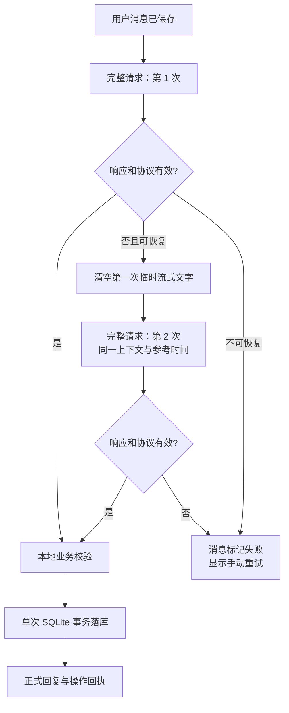

# 小知完整请求自动重试设计

状态：已实施，等待 Dev 真机验收

## 1. 决策与方案比较

删除“把失败 JSON 交给模型修格式”的二次调用。模型响应失败时，系统最多重新执行一次完整的小知请求，让模型基于同一份用户原话、上下文快照、参考时间和候选对象重新完成回复、事件与待办判断。

采用方案 A：完整请求自动重试一次。它能覆盖超时、网络波动、服务端错误、空响应和协议错误，也不会继承第一次响应里可能已经错误的语义。代价是失败轮最多消耗两次完整上下文的 Token，最长等待可能从 45 秒增加到 90 秒。

不采用方案 B：继续调用模型只修 JSON。虽然第二次输入较短，但会保留第一次可能已经错误的判断，而且本次真机证明恢复过程与首次请求耦合、排障困难。

不采用方案 C：失败后立即交给用户手动点“重试”。Token 最省，但偶发的模型或网络错误直接暴露给用户，简单表达也需要多操作一次。

## 2. 状态与数据流

两次模型尝试期间不写助手回复、待办、事件或关系；只有某次完整响应通过协议与业务校验后才进入现有事务，因此不会产生第一次半成功、第二次重复落库的问题。第二次尝试继续使用原请求 ID；之后用户手动重试也复用该 ID，保持现有幂等约束。

## 3. 重试边界

自动重试一次：连接中断、请求超时、HTTP 429、HTTP 5xx、空响应、损坏的流式数据、顶层 JSON 或必要协议字段不合法。

不自动重试：未配置 API Key、HTTP 400/401/403 等明确配置或鉴权错误、用户/系统主动取消、模型响应合法但某个业务操作被本地校验拒绝、SQLite 事务失败。后两类已经越过模型响应阶段，再调用模型不会修复本地数据问题。

每次完整尝试拥有独立的 45 秒超时，但都监听同一个外部取消信号。第一次失败后立即开始第二次，不做长退避；若首轮已经向页面流出临时回复，第二次开始前清空，避免两份文字拼接。第二次失败后停止自动请求，恢复输入框并在原消息下显示现有“重试”。

## 4. 日志与兼容

决策日志记录 `attempt_count`、每次尝试的错误码、脱敏且限长的错误详情、耗时和可获得的 Token 用量。成功日志明确标记由第几次尝试完成；失败日志保留两次错误，不能再只留下最终 `timeout`。

旧的 `repair_count`、`repair_status` 数据库列为兼容既有 Dev 数据保留，但新请求不再执行或记录 JSON 修复。代码与提示词中删除 repair prompt、repair request 和相关测试。

## 5. 边界与验收标准

1. 第一次返回非法 JSON、第二次返回合法完整结果时，只保存一条助手回复和一组操作。
2. “明天我要吃个苹果”第二次成功时，只建立日期正确的待办，不建立事件。
3. 第一次流出部分文字后失败，第二次文字从空状态重新显示，不拼接旧内容。
4. 两次均失败后停止自动调用，原消息保留，显示一次手动重试入口，输入框恢复。
5. 401、缺少 Key 和主动取消只调用一次；429、5xx、网络、超时、空响应及协议错误最多调用两次。
6. 两次请求使用相同上下文快照、用户消息、参考时间与候选 ID，不因重试跨日改变“明天”的日期。
7. 第一次失败不进入本地业务校验或 SQLite 事务；最终成功仍使用现有幂等事务。
8. 日志能分别看到两次尝试的原因、耗时与 Token，且不保存 API Key、Authorization、完整提示词或完整模型正文。
9. 所有新增测试纳入 `npm test`；交付前 `npm run ci` 和 GitHub `CI / validate` 通过，并在现有 Dev Tunnel Reload 后真机验收。

## 6. 实施范围

- 重构 `src/assistant/provider.ts`：移除 JSON 修复请求，提取单次完整请求，增加最多两次的重试编排与独立超时。
- 扩展 provider / decision-log 元数据和 SQLite 增量迁移，保留旧字段但停止写入新修复状态。
- 调整流式临时文本重置，不改变最终回复、事件、待办和事务协议。
- 替换协议测试中的“修复 JSON”用例为完整请求重试、不可重试错误、两次失败和流式重置用例。
- 更新既有韧性设计，标记“小型格式修复”已被本设计取代。
