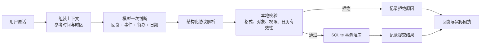

# 小知模型日期理解与决策日志设计

状态：已实施，等待 Dev 真机验收

关联设计：[小知待办与事件操作设计](2026-09-15-xiaozhi-todo-event-actions-design.md)

## 1. 决策

待办是否建立、属于哪个事件以及用户日期原文的含义，均由同一次主模型调用判断。本地代码不再用中文日期正则重新理解“下个月 10 号”等表达，也不增加“出现未来时间就必须建立待办”的确定性业务规则。

模型负责输出：

- 是否提出 `create_todo` / `update_todo`；
- 日期判断状态 `date_status`：`resolved`、`ambiguous` 或 `absent`；
- 用户日期原文 `date_text`；
- 已解析的本地日期 `due_date`，格式为 `YYYY-MM-DD`；
- 可选本地时间 `due_time`，格式为 `HH:mm`；
- 时间精度 `date` 或 `dateTime`。

例如用户在 2026-09-15 说“下个月 10 号还”，模型可以判断同时提出：更新贷款事件、创建关联待办；待办日期字段为：

```json
{
  "date_status": "resolved",
  "date_text": "下个月10号",
  "due_date": "2026-10-10",
  "due_time": null,
  "time_precision": "date"
}
```

事件与待办不是互斥分类。模型应分别判断“是否需要维护主线当前状态”和“是否形成用户准备执行的具体下一步”，因此同一句话可以只更新事件、只建立待办、两者都做，或都不做。

## 2. 方案比较

### 方案 A：模型输出本地日期字段（采用）

优点是日期语义由模型完整理解，结构清晰、便于审计，也避免 Unix 时间戳的时区歧义。本地只做格式、安全与数据一致性校验。

### 方案 B：模型直接输出 ISO 时间戳

协议较短，但“仅日期”容易被错误地解释为 UTC 或某个具体时刻，无法准确表达全天日期，不采用。

### 方案 C：模型只抄日期原文，本地规则解析

离线确定，但会重复做语义理解，且已证明无法覆盖“下个月 10 号”等自然表达，不采用。

## 3. 数据流



本地允许检查 `2026-02-30` 不是有效日期、`25:80` 不是有效时间、候选对象 ID 不存在、操作数量超限等；但不再根据“下个月”重新计算日期，也不因为句子含日期而自行补建待办。

协议字段之间只做结构一致性检查：`resolved` 必须带有效的 `due_date` 与精度；`absent` 不得带日期值；`ambiguous` 可以保留 `date_text`，但不带 `due_date`。这是对模型输出格式的校验，不是代码重新解释用户语言。

仅日期的待办按现有存储约定机械转换为用户本地时区当天 09:00，并保存 `time_precision='date'`；有明确时间则按模型给出的本地时间转换并保存 `time_precision='dateTime'`。这一步是存储投影，不参与语义判断。

## 4. 模型提示词调整

提示词明确以下原则，但最终仍由模型结合对话判断：

1. 待办表示用户已经表达或接受的具体行动；模型自己提出而用户尚未接受的建议不是待办。
2. 事件表示持续变化的主线状态；已有事件里的具体下一步可以同时成为关联待办。
3. 日期必须以当前参考时间和用户本地时区解析，保留原文，并输出本地日期、可选时间和精度。
4. 日期确实含糊时不猜测：可以创建无日期隐藏待办，并在自然回复中最多追问一个必要问题。
5. 自然回复不得宣称操作已经完成，成功事实仍以事务提交后的回执为准。

## 5. 决策日志

新增仅保存在设备本地的结构化决策日志。它不进入用户日常页面、不上传、不导入个人备份，也不记录 API Key 或 HTTP Authorization。

每轮至少记录：

- `request_id`、消息 ID、时间、模型名、提示词版本、参考时间与时区；
- 本轮选中的最近消息 ID、历史分段 ID、旧记录 ID、事件与待办候选 ID；
- 模型提出的结构化操作，包括操作类型、目标引用、`date_text`、`due_date`、`due_time` 和精度；
- 每个候选操作的校验结果，以及 `invalid_calendar_date`、`candidate_not_allowed`、`ambiguous_candidate` 等明确原因；
- 最终提交的操作 ID、事务成功或失败、模型耗时、提交耗时，以及供应商返回的 token usage / finish reason（存在时记录）。

不重复保存完整系统提示词和完整对话正文；日志通过消息和上下文对象 ID 回溯已有事实。默认保留最近 500 轮，超过后删除最旧日志，避免无限增长。开发环境同时输出一行脱敏摘要，便于 Metro 直接排障。

通过该日志可以明确区分：

- 模型没有提出待办；
- 模型提出待办但日期字段非法；
- 待办通过校验但事务失败；
- 待办已经提交，只是 UI 回执或首页投影未显示。

## 6. 错误与边界

- 模型判断 `date_status='absent'` 或 `ambiguous`：按无日期隐藏待办处理；其中 `ambiguous` 允许小知追问一次，不使用代码从 `date_text` 补算。
- 模型判断 `date_status='resolved'` 却不给 `due_date`：作为协议错误拒绝该待办并记录原因，不能悄悄降级成无日期待办。
- 模型给出非法日历日期：拒绝该操作并记录原因；其他合法操作仍按现有“部分接受”策略执行。
- 模型给出的日期与用户原文语义不一致：本地不做第二套自然语言解析；日志保留两者，后续可通过模型质量用例和提示词修正。
- 用户纠正日期：模型对同一待办提出 `update_todo`，保留新原文和新解析日期。
- 跨月、跨年、闰年、相对星期、月底和带时段表达均由模型解析，测试以固定参考时间和时区验证。
- 供应商未返回 token usage 或 finish reason：字段留空，不影响回复和落库。
- 日志写入失败：不能阻断用户回复和业务事务；输出开发告警，下一轮继续尝试。

## 7. 验收标准

1. 固定参考时间为 2026-09-15、时区为 Asia/Shanghai 时，“下个月 10 号还”由模型判断是否建立待办；若建立，输出日期 2026-10-10，本地不调用中文日期规则解析原文。
2. 已有贷款事件时，模型可以在同一轮提出 `update_event`、`create_todo` 和 `link_todo_event`，三项经校验后一次事务提交。
3. 模型只提出 `update_event` 时，系统不自行补建待办，日志明确记录该轮没有 `create_todo` 候选。
4. 模型提出非法日期时，该操作被拒绝，日志能看到原始日期字段和拒绝原因；不得误显示成功回执。
5. 无日期或含糊日期的行动可以形成隐藏待办，不被代码擅自补日期。
6. 日志可区分模型建议、校验结果、事务结果和 UI 投影四个阶段，且不包含 API Key、Authorization 或完整系统提示词。
7. 日期协议覆盖仅日期、明确时间、跨月、跨年、闰年、月底和相对星期测试。
8. 所有新增自动化测试纳入 `npm test`，交付前 `npm run ci` 和 GitHub `CI / validate` 通过。

## 8. 实施范围

确认后在现有 `codex/xiaozhi-todos-events` 分支和 PR #19 上继续，不另开重复 PR：

1. 扩展模型操作协议和提示词版本；
2. 将待办日期输入从本地自然语言解析改为模型结构化日期；
3. 增加日期字段的纯格式 / 日历有效性校验和本地时间投影；
4. 增加结构化决策日志表与保留策略；
5. 增加模型协议、校验、数据库、编排与质量用例；
6. 运行 `npm run ci`，通过后更新 PR 并进行 Dev 真机验收。
