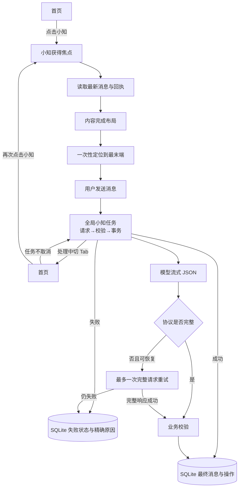

# 小知定位、跨 Tab 运行与协议容错设计

状态：已实施，等待 Dev 真机验收

> 2026-09-15 更新：本文中的“小型格式修复”方案已被[完整请求自动重试设计](./2026-09-15-xiaozhi-full-request-retry-design.md)取代。当前实现不再把错误 JSON 交给模型修补，而是基于同一上下文最多重做一次完整请求。

## 1. 已确认的问题

### 进入小知没有定位到最末端

当前页面在数据写入 React 状态后，只等待一次 `requestAnimationFrame` 就调用 `scrollToEnd`。消息气泡、操作回执和 FlatList 内容高度仍可能继续变化，因此滚动使用了旧高度，最终停在倒数几条。`maintainVisibleContentPosition` 还会优先维持旧可见位置，使这个问题更明显。

### 切到首页是否中断

不会。模型任务保存在模块级 `jobs` Map 中，不依附小知 Tab 的焦点状态；切到首页后请求、校验和 SQLite 事务继续运行。失焦期间只停止流式文字的页面刷新。再次进入小知时，页面从数据库加载 `sending`、`failed` 或最终成功结果。

该保证只覆盖 App 仍在前台运行的情况；锁屏、强退或被 iOS 挂起时，普通 JavaScript 网络任务不保证继续执行。

### 多次重试仍为 invalid-response

设备日志证明请求已经进入模型阶段，最终错误为 `invalid-response`，不是 API Key、HTTP 或网络错误。最小无历史请求使用同一模型可以返回合法流式 JSON，说明基础连接正常。

根因是现行协议过度使用“整轮失败”：只要自然回复出现“记下了/更新了”等措辞，或六个候选操作中任意一个字段不合规，完整回复、其他合法操作和流式结果都会被丢弃。已有历史回复中恰好存在这些成功措辞，模型容易延续旧表达，导致用户重复重试仍命中同一冲突。现有日志只记 `invalid-response`，没有记具体协议原因，又放大了排障成本。

## 2. 方案比较

### 方案 A：分层容错（历史方案，重试部分已被取代）

- 进入 Tab 时设置一次性“定位末端”意图，等 FlatList 完成真实内容布局后再滚动；加载历史时不触发。
- 保留现有全局任务，不因切 Tab 取消；回到页面后始终以数据库状态恢复。
- 自然回复中的成功措辞不再令整轮失败；只有事务真正提交后才保存正式助手消息和操作回执。
- 顶层 JSON 或必要字段损坏时，自动进行最多一次小型格式修复；不携带完整历史，只修复模型刚返回的 JSON。
- 单个候选操作解析失败时记录具体原因；格式修复成功后继续统一校验和原子落库。
- 日志增加精确 `error_detail`、修复次数和修复结果，不保存完整对话或 API Key。

优点：正常请求不增加延迟；历史措辞不会再卡死；真正的模型格式偶发错误可自动恢复。缺点：极少数格式损坏请求会多一次模型调用。

### 方案 B：完全放宽协议

永远保留自然回复，忽略所有坏操作。速度最快，但容易出现“小知说记好了，实际没落库”，不采用。

### 方案 C：可恢复错误完整重问模型一次（后续采用）

后续真机错误证明，仅修 JSON 会保留第一次的错误语义，因此改为仅对可恢复错误完整重问一次。边界以替代设计为准。

## 3. 页面与任务状态图

## 4. 交互结果

- 每次从其他 Tab 进入小知，默认显示最后一条消息的底部，输入框不会遮住回执。
- 用户主动向上翻历史后，流式更新不会强行抢走阅读位置；只有用户仍接近末端时才跟随新文字。
- 切到首页不会显示额外提示，也不会取消小知。回到小知时：仍处理中就继续显示“正在想”，已经完成就直接显示最终回复和回执。
- 两次完整请求仍无法恢复时显示“回复出了点问题 · 重试”，决策日志分别保留两次尝试的错误码、限长原因、耗时和 Token，不再只有笼统错误码。

## 5. 验收标准

1. 至少 100 条消息和多张回执时，从首页点击小知能完整看到最后一条与输入框上沿。
2. 加载更早记录不会跳回底部；用户上滑阅读时，新流式文字不会抢滚动位置。
3. 发送后立即切首页，模型请求仍继续；处理中返回能看到进行态，完成后返回能看到正式结果。
4. 历史消息包含“记下了”“改过来了”时，新一轮不因模型延续同类措辞而失败。
5. 正常格式不触发第二次请求；可恢复错误最多完整重试一次，不形成无限重试。
6. 模型、校验或事务失败不生成虚假成功回执；日志记录精确阶段和原因。
7. 新增用例进入统一 `npm test`，交付前 `npm run ci` 全量通过，并使用现有 Tunnel 对 Dev 真机 Reload 验收。
