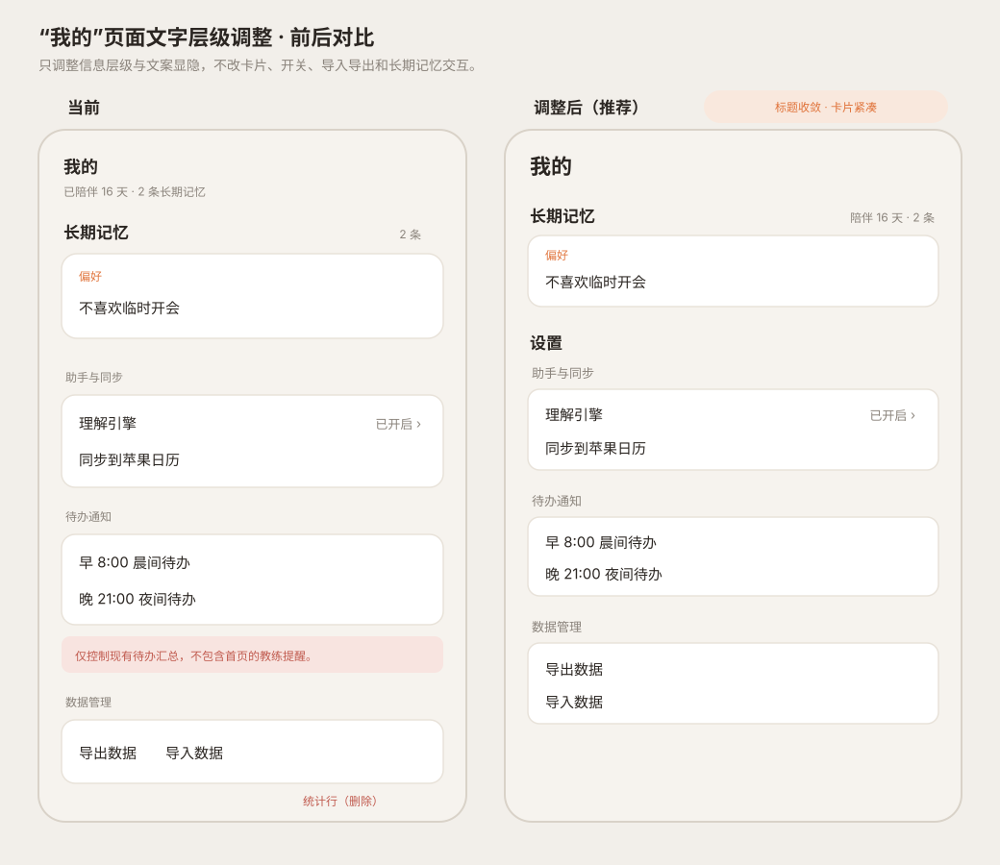

# “我的”页面文字层级微调

状态：用户已确认（2026-09-16），已进入实现

## 目标

只收敛“我的”页面的信息层级，不改变长期记忆、理解引擎、日历、通知、导入导出的功能或交互。

## 方案

- 页面标题“我的”从 18 调整到 22，与“小知”页标题完全复用 `theme.font.title` 和 `semibold` 字重；标题下不再放陪伴摘要。
- 一级模块固定为“长期记忆”和“设置”，二者均为 17、粗体。
- “陪伴 X 天 · X 条”放到“长期记忆”标题行右侧，作为该模块的弱辅助信息；不另占一行。
- “助手与同步 / 待办通知 / 数据管理”成为“设置”下的二级分组，统一为 13、弱色，不使用粗体。
- 删除通知分组后的解释小字。
- 删除页面末尾统计卡；长期记忆标题行右侧的摘要承担天数和数量概览。
- 全页采用紧凑密度：记忆卡纵向 padding 从 12 缩到 10；设置卡外间距约 8；行内视觉高度收紧，但所有按钮和开关的可点击区域仍不小于 44。
- 卡片内容、开关、错误态、空态、编辑和撤销逻辑保持不变。

## 验收标准

1. “我的”和“小知”两个 Tab 的页面标题视觉一致。
2. “我的”下方不单独出现陪伴摘要；摘要位于“长期记忆”标题行右侧。
3. “长期记忆”与“设置”同级、同字号、同字重。
4. 三个设置分组标题一致且比一级模块小一档。
5. 页面不再出现“仅控制现有待办汇总……”和底部“统计”。
6. 卡片整体更紧凑，点击区域仍满足 44px；通知、导入导出和长期记忆操作不受影响。

