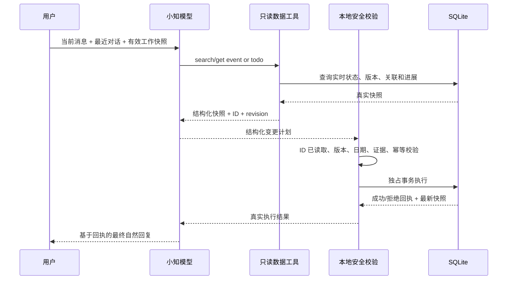
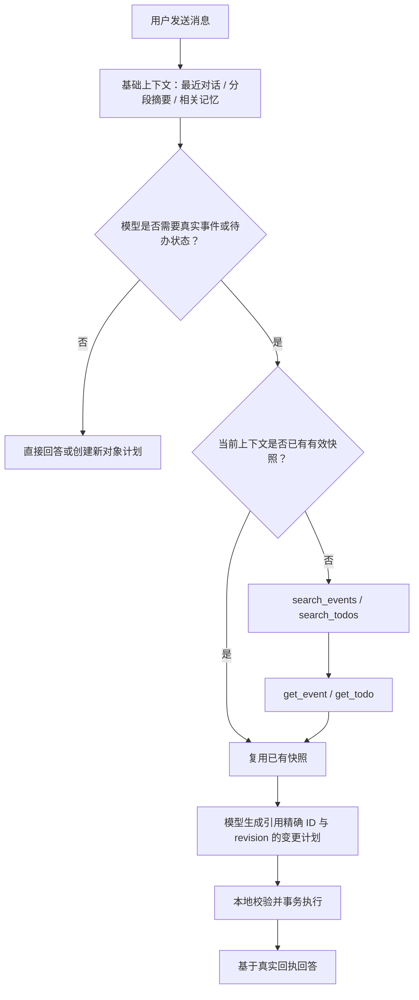

# 小知真实状态闭环设计

## 目标

小知在回答事件、待办问题或执行更新前，必须先读到数据库中的真实状态；最终回复只能基于本地真实执行结果，不能把模型的计划当作已完成事实。

## 当前问题

现有链路让模型和本地各做一次“它属于哪个事件”的语义判断。模型已经返回精确事件 ID 时，本地仍可能因为候选分数接近而判为歧义，导致写入被拒绝；但模型的提前回复仍被展示，形成“说已更新、实际没更新”。

## 页面状态（用户可见）

```text
用户发出消息
    │
    ▼
┌──────────────────────────────┐
│  小知正在读取事件和待办 · 3 秒  │  可随时停止，输入框仍可编辑
└──────────────────────────────┘
    │
    ▼
┌──────────────────────────────┐
│  小知正在整理处理方案 · 8 秒    │  模型判断，但不展示未兑现的回复
└──────────────────────────────┘
    │
    ▼
┌──────────────────────────────┐
│  小知正在更新 · 10 秒          │  本地校验并事务写入
└──────────────────────────────┘
    │
    ▼
┌──────────────────────────────┐
│  小知正在回答 · 12 秒          │  模型只根据真实执行回执组织回答
└──────────────────────────────┘
    │
    ▼
┌──────────────────────────────┐
│ 已更新十一出行，并创建 10 月 1 日… │  卡片只展示真实成功的操作
└──────────────────────────────┘
```

## 数据流



### 基础上下文与按需读取

事件和待办的正文不进入基础上下文。小知的首个模型请求只携带最近对话、当前分段摘要、相关长期记忆，以及显式入口的对象类型和 ID；即使当前分段曾关联某个事件或待办，也不能因此自动附加该对象的标题、状态、进展或关联待办。



从事件或待办详情进入小知时，入口只提供对象类型和 ID，不预先附加正文；模型仍需调用 `get_event` 或 `get_todo` 读取最新状态。这样显式入口、连续短回复和普通新话题共用一套读取链路。

## 协议与职责

### 1. 模型按需读取

提供四个只读工具：

- `search_events(query)`：搜索活跃事件，返回精简候选。
- `get_event(event_id)`：读取事件完整当前状态、最近进展、关联待办和 revision。
- `search_todos(query, include_done)`：搜索待办。
- `get_todo(todo_id)`：读取待办当前内容、日期、完成状态、revision 和关联事件。

工具阶段最多 4 轮、8 次调用，搜索结果有数量上限；超出后不判失败，进入一次无工具收敛轮，模型基于已读信息给出计划并声明未核实部分。基础上下文不提供事件/待办候选正文；搜索与读取工具是模型获得现有对象真实状态的唯一入口。

基础请求不再包含“可更新的事件候选”或“可更新的待办候选”正文，也不再因为当前分段的历史关联强制加入旧对象。模型可从最近对话和分段摘要理解语义，需要真实数据时必须调用读取工具：

- 明确 ID 入口：直接 `get_event` / `get_todo`。
- 用户说出名称或线索：先 `search_events` / `search_todos`，再读取目标详情。
- “对”“就这个”等短回复：利用最近对话判断搜索词或显式入口 ID，再读取目标详情。
- 完全无关的新话题：不调用事件/待办工具，不发送任何旧对象内容。

### 读取判定与短期工作快照

模型先判断当前任务是否依赖事件/待办的真实状态，再判断所需对象是否已经存在于本轮可用上下文。只有以下内容属于“已有有效快照”：

- 本轮刚由 `get_event` / `get_todo` 返回的结果；
- 当前活跃对话中此前明确读取过、仍在短期工作上下文内，且本地 revision 没有变化的结构化快照。

以下内容不等于真实快照，不能据此回答精确状态或执行更新：

- 用户或助手在自然语言历史中提到过某个事件；
- 当前分段曾经绑定过某个对象；
- 长期记忆中保存了相关偏好或背景；
- 只有事件/待办 ID，但没有当前 revision 和所需字段。

每份短期工作快照至少包含对象类型、ID、revision、读取时间和本轮需要的字段。模型需要的信息已完整且 revision 有效时直接复用，不重复搜索或读取；缺少字段、对象未知或 revision 已变化时再调用工具。

快照在对象被更新、完成、删除、撤销、导入覆盖或本地 revision 改变时立即失效；切换到无关话题后不再进入模型上下文。App 重启后可以清空短期工作快照，后续按需重新读取，不把它升级为“我的”长期记忆。

### 2. 模型负责语义，本地负责安全

模型负责：

- 判断用户指的是哪个事件/待办；
- 判断是更新事件、新建/更新待办，还是需要澄清；
- 解析相对日期；
- 生成完整事件增量。

本地负责：

- 目标 ID 必须来自本轮精确详情读取，或当前分段中 revision 仍有效且实际送入模型的工作快照；
- revision 未过期；
- 证据来自本轮或最近用户原话；
- 日期格式、引用完整性和删除策略合法；
- 幂等和 SQLite 独占事务。

本地不再根据文本相似度重新否决模型已经读取并选定的事件。

### 3. 执行后再回答

规划阶段的 `reply` 不向用户显示，也不保存为最终回复。本地执行后生成结构化回执：

- `committed`：真实写入的操作及最新对象快照；
- `rejected`：被拒绝的操作和原因；
- `no_change`：模型判断无需写入；
- `failed`：事务或基础设施失败。

模型用回执生成最终自然回复。若最终回复调用失败，客户端使用本地回执生成确定性兜底文案，绝不虚报成功。

## 关键边界

- 短回复（如“对”“就这个”）可以引用最近六条用户原话作为证据。
- 搜索到多个近似对象时，由模型结合完整对话选择或追问；本地不再用相似度二次裁决。
- 对象在读取后被修改时，revision 校验拒绝写入，最终回复明确说明状态已变化，需要重新确认。
- 删除仍遵守既有规则：删除事件且有关联待办时，必须有明确 `keep/delete` 决策。
- 模型未调用工具也可以处理新建对象；更新已有对象必须已在本轮可读集合中。
- 分段关联只作为理解线索，不能把关联对象正文注入基础上下文，也不能让对象永久锁定后续对话。
- 显式事件/待办入口只提供 ID 指针，不直接授权更新；执行写入前仍需精确读取或命中有效快照。
- 同一对象在同一轮已经读取且字段充足时不得重复调用读取工具；跨轮复用必须命中仍有效的短期工作快照。
- 本地提交前仍校验 revision；若快照已经过期则拒绝写入，并要求模型重新读取，不能用旧状态覆盖新状态。
- 取消发生在写库前：不写入；发生在事务完成后：保留已提交数据，并保留本地回执，不能回滚成“未发生”。

## 验收标准

1. “十一出行”回归用例中，模型给出并读取精确事件 ID 后，不会再被 `ambiguous_candidate` 拒绝。
2. 模型能搜索和读取初始候选列表之外的事件、待办。
3. 模型最终回复中所称的成功项，与数据库真实 committed 操作完全一致。
4. 本地拒绝或事务失败时，最终回复不得声称已更新。
5. 最近用户消息中的证据可支持“对，10 月 1 日……”这类连续补充。
6. 运行状态依次可见：读取、整理方案、更新、回答；计时持续递增。
7. 决策日志不再把零写入错误标为 committed，并记录工具读取范围与执行结果。
8. `npm run ci` 全部通过。
9. 普通新消息的首个模型请求不包含任何事件或待办正文；无关旧事件即使包含上游拒绝内容，也不能阻断新消息。
10. 更新、完成或删除已有事件/待办前，目标对象必须在本轮通过读取工具获取；仅凭历史分段绑定不得写入。
11. 从事件/待办详情进入小知时只传类型与 ID，模型读取最新状态后再回答或操作。
12. “对”“继续刚才那个”等连续短回复可依靠最近对话、摘要和读取工具恢复目标，不要求预注入完整候选。
13. 同一轮连续追问同一对象时复用工具结果，不重复读取；下一轮若短期工作快照 revision 未变化，也可直接复用。
14. 对象被其他操作修改后，旧快照立即失效；后续回答或写入前必须重新读取最新状态。
