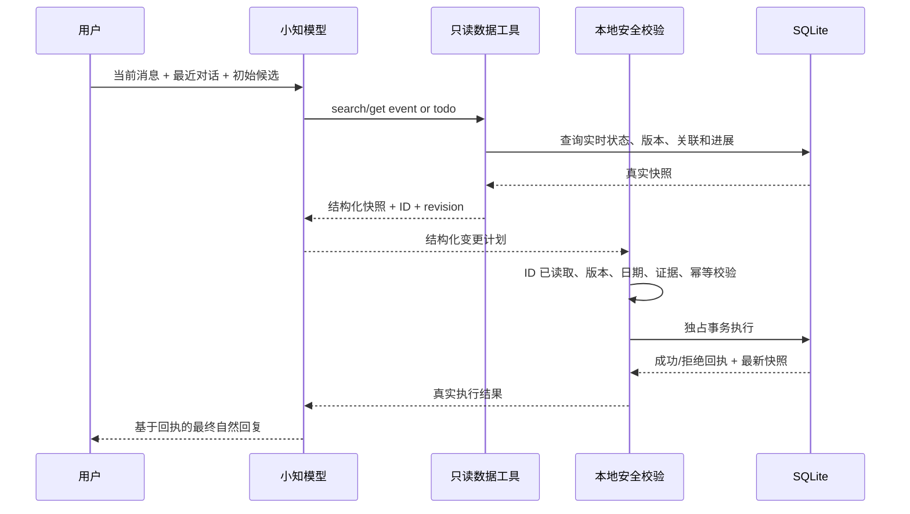

# 小知真实状态闭环设计

## 目标

小知在回答事件、待办问题或执行更新前，必须先读到数据库中的真实状态；最终回复只能基于本地真实执行结果，不能把模型的计划当作已完成事实。

## 当前问题

现有链路让模型和本地各做一次“它属于哪个事件”的语义判断。模型已经返回精确事件 ID 时，本地仍可能因为候选分数接近而判为歧义，导致写入被拒绝；但模型的提前回复仍被展示，形成“说已更新、实际没更新”。

## 页面状态（用户可见）

```text
用户发出消息
    │
    ▼
┌──────────────────────────────┐
│  小知正在读取事件和待办 · 3 秒  │  可随时停止，输入框仍可编辑
└──────────────────────────────┘
    │
    ▼
┌──────────────────────────────┐
│  小知正在整理处理方案 · 8 秒    │  模型判断，但不展示未兑现的回复
└──────────────────────────────┘
    │
    ▼
┌──────────────────────────────┐
│  小知正在更新 · 10 秒          │  本地校验并事务写入
└──────────────────────────────┘
    │
    ▼
┌──────────────────────────────┐
│  小知正在回答 · 12 秒          │  模型只根据真实执行回执组织回答
└──────────────────────────────┘
    │
    ▼
┌──────────────────────────────┐
│ 已更新十一出行，并创建 10 月 1 日… │  卡片只展示真实成功的操作
└──────────────────────────────┘
```

## 数据流



## 协议与职责

### 1. 模型按需读取

提供四个只读工具：

- `search_events(query)`：搜索活跃事件，返回精简候选。
- `get_event(event_id)`：读取事件完整当前状态、最近进展、关联待办和 revision。
- `search_todos(query, include_done)`：搜索待办。
- `get_todo(todo_id)`：读取待办当前内容、日期、完成状态、revision 和关联事件。

工具每轮最多执行 4 次，搜索结果有数量上限，避免上下文和延迟无限增长。初始候选仍用于快速命中，工具用于补查、确认和读取候选外对象。

### 2. 模型负责语义，本地负责安全

模型负责：

- 判断用户指的是哪个事件/待办；
- 判断是更新事件、新建/更新待办，还是需要澄清；
- 解析相对日期；
- 生成完整事件增量。

本地负责：

- 目标 ID 必须来自本轮初始快照、显式入口或只读工具结果；
- revision 未过期；
- 证据来自本轮或最近用户原话；
- 日期格式、引用完整性和删除策略合法；
- 幂等和 SQLite 独占事务。

本地不再根据文本相似度重新否决模型已经读取并选定的事件。

### 3. 执行后再回答

规划阶段的 `reply` 不向用户显示，也不保存为最终回复。本地执行后生成结构化回执：

- `committed`：真实写入的操作及最新对象快照；
- `rejected`：被拒绝的操作和原因；
- `no_change`：模型判断无需写入；
- `failed`：事务或基础设施失败。

模型用回执生成最终自然回复。若最终回复调用失败，客户端使用本地回执生成确定性兜底文案，绝不虚报成功。

## 关键边界

- 短回复（如“对”“就这个”）可以引用最近六条用户原话作为证据。
- 搜索到多个近似对象时，由模型结合完整对话选择或追问；本地不再用相似度二次裁决。
- 对象在读取后被修改时，revision 校验拒绝写入，最终回复明确说明状态已变化，需要重新确认。
- 删除仍遵守既有规则：删除事件且有关联待办时，必须有明确 `keep/delete` 决策。
- 模型未调用工具也可以处理新建对象；更新已有对象必须已在本轮可读集合中。
- 取消发生在写库前：不写入；发生在事务完成后：保留已提交数据，并保留本地回执，不能回滚成“未发生”。

## 验收标准

1. “十一出行”回归用例中，模型给出并读取精确事件 ID 后，不会再被 `ambiguous_candidate` 拒绝。
2. 模型能搜索和读取初始候选列表之外的事件、待办。
3. 模型最终回复中所称的成功项，与数据库真实 committed 操作完全一致。
4. 本地拒绝或事务失败时，最终回复不得声称已更新。
5. 最近用户消息中的证据可支持“对，10 月 1 日……”这类连续补充。
6. 运行状态依次可见：读取、整理方案、更新、回答；计时持续递增。
7. 决策日志不再把零写入错误标为 committed，并记录工具读取范围与执行结果。
8. `npm run ci` 全部通过。

