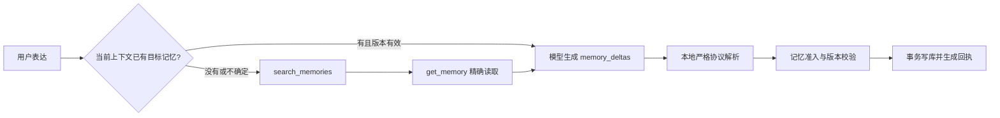

# 小知长期记忆读取工具设计

## 目标

小知需要按需读取用户的长期记忆，并基于数据库中的真实状态回答、更新或删除记忆。模型不能只凭对话中的模糊称呼猜测记忆 ID，也不能让搜索结果直接获得写权限。

## 设计

### 工具

- `search_memories(query, status?)`
  - 默认搜索 `active` 与 `candidate`。
  - 返回候选的 ID、内容、分类、状态和版本。
  - 仅用于发现候选，不授权更新、激活或删除。
- `get_memory(memory_id)`
  - 返回内容、分类、敏感级别、准入依据、状态、版本及关键时间。
  - 只有精确读取成功的记忆 ID，才加入本轮可变更集合。
  - 已遗忘或已替代记忆可读取真实状态，但不能通过现有规则再次修改。

### 写入边界

模型仍通过既有 `memory_deltas` 提出 `create_active`、`create_candidate`、`activate_candidate`、`supersede_memory`、`forget_memory`。工具本身不直接写数据库。本地继续严格校验完整 JSON、用户证据、记忆状态及 `expectedRevision`，校验失败则整项拒绝。

### 上下文选择

当前消息真正相关的活动记忆可直接进入上下文，并继续具有本轮校验资格。相关性为零的活动记忆不再默认注入，避免无关个人信息污染回答。若目标未被召回，模型通过工具搜索与精确读取。

精确读取成功后，结果进入当前对话分段的版本化短期快照。下一轮需要同一条记忆且数据库版本未变化时直接复用；版本变化后快照自动失效并重新读取。

### 日志

决策日志新增 `tool_read_memory_ids_json`，记录本轮被精确读取的记忆 ID。搜索候选不会写入该字段。

## 边界情况

- 搜索无结果：模型应说明未找到，不得捏造删除成功。
- 搜索命中多个：模型可继续精确读取一个或多个候选；不强制在第一次读取后结束工具阶段。
- 精确结果不符合预期：模型可继续调用其他搜索或读取工具，单轮最多 4 轮、8 次读取；超出后进入无工具收敛轮，模型基于已读信息回答并声明未核实部分。
- 精确读取后版本变化：本地版本校验拒绝写入，不能覆盖新状态。
- 只搜索未精确读取：对既有记忆的激活、替代、遗忘均拒绝。
- 创建全新记忆：不要求先调用读取工具，继续按长期记忆准入规则校验。
- 缺少 `evidence` 等协议字段：仍按严格协议失败，不做局部容错，也不做二次 JSON 修复。

## 验收标准

1. 小知能搜索并精确读取活动或候选长期记忆。
2. 搜索结果不能单独授权更新或删除；精确读取可以。
3. `get_memory` 返回数据库中的真实状态和版本。
4. 无关活动记忆不再进入普通对话上下文。
5. 决策日志能区分精确读取的记忆 ID。
6. 同一分段内未过期的记忆详情可复用，版本变化后自动失效。
7. 原有事件、待办工具及严格记忆写入规则不回归。
8. `npm run ci` 全量通过，Dev 端 Reload 后可验收。
