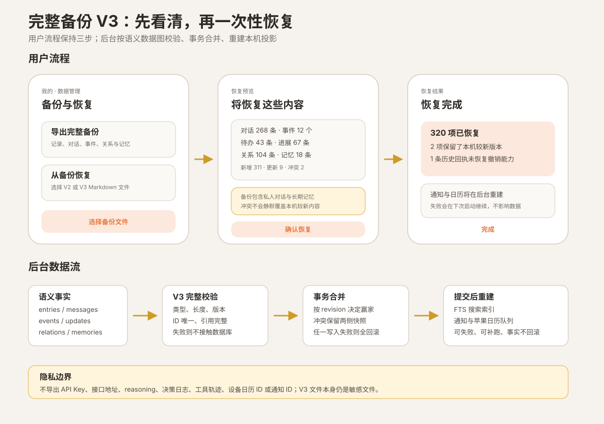

# 完整备份 V3 设计

> 状态：2026-09-22 用户确认，进入实施
>
> 目标：让一次 App 内导出能够在全新安装或另一份本地数据库中恢复用户可感知的完整状态，包括小知对话、事件轨迹、关系和操作回执；继续排除密钥与运行诊断。



## 1. 当前问题

当前 `assistant-app-export-v2` 只覆盖旧 `entries`、画像、主题偏好、长期记忆及记忆来源。小知上线后新增的连续对话、事件、事件进展、对象关系和操作回执没有进入备份。

这造成两个直接风险：

1. 删除重装前即使完成 App 内导出，恢复后仍会丢失主要的小知使用历史。
2. `PRD.md` 中“原声、待办、事件和记忆可迁移或备份”的状态高于真实能力。

V3 的目标是修复数据主权，不顺带实现云同步、端到端加密或跨用户合并。

## 2. 方案比较

### 方案 A：直接导出数据库文件

优点：实现快，理论上不漏表。缺点：强绑定 SQLite schema 和原生版本；无法安全合并；包含 Key、设备绑定 ID、诊断日志和缓存；很难向后兼容。

不采用。

### 方案 B：版本化语义数据图（推荐）

继续使用人类可读 Markdown + 机器数据胶囊，但 V3 明确列出用户语义对象、引用和校验规则。导入先完整验证，再以事务方式合并，并在提交后重建设备相关投影。

优点：隐私边界明确，可测试、可合并、可演进。缺点：需要为每类对象维护序列化、校验和冲突规则。

### 方案 C：只给 V2 增加事件和消息数组

优点：代码改动较少。缺点：没有请求、关系和操作回执后，对话虽然存在，但历史回执、事件来源与撤销语义不完整；以后仍要再次升级。

不采用。

选择方案 B。

## 3. V3 数据边界

### 必须导出

| 领域 | 数据 | 原因 |
|---|---|---|
| 旧记录与待办 | `entries` | 当前待办事实来源，包含完成、日期和通知语义 |
| 用户偏好 | `profile`、`topic_preferences` | 恢复当前可见设置与历史主题展示 |
| 连续对话 | `conversation_segments`、`assistant_requests`、`assistant_messages` | 恢复完整原话、回复、分段与重试状态 |
| 事件 | `assistant_events`、`assistant_event_aliases`、`assistant_event_updates` | 恢复主线、当前状态和历史轨迹 |
| 关系 | `assistant_object_relations` | 恢复消息、待办、事件和进展之间的真实关联 |
| 回执与撤销 | `assistant_operations` | 历史消息中的“已处理”回执依赖操作记录 |
| 长期记忆 | `assistant_memories`、`assistant_memory_sources` | 恢复已生效、候选、替代和忘记状态及来源 |

### 明确不导出

- `settings` 中的 LLM Key、Base URL、模型名和启用状态。
- `assistant_reasoning`、`assistant_decision_logs`、工具调用轨迹、Token 用量和错误详情。
- `assistant_migrations`、工作快照、FTS 表及其他可重建缓存。
- 苹果日历事件 ID、本地通知 ID、同步 owner token 和队列执行状态。
- Dev / Release 的 Bundle ID 或设备签名信息。

理由：这些内容要么敏感，要么只服务调试和当前设备运行，不属于用户需要跨安装恢复的事实。

## 4. 格式

新增独立类型，避免继续扩大含义已经固定的 V2：

```ts
interface BackupEnvelopeV3 {
  format: 'assistant-app-export-v3';
  schemaVersion: 3;
  exportedAt: number;
  counts: Record<BackupObjectKind, number>;
  payload: {
    entries: Entry[];
    profile: Profile;
    topicPreferences: TopicPreference[];
    conversationSegments: BackupConversationSegment[];
    assistantRequests: BackupAssistantRequest[];
    assistantMessages: BackupAssistantMessage[];
    events: BackupEvent[];
    eventAliases: BackupEventAlias[];
    eventUpdates: BackupEventUpdate[];
    objectRelations: BackupObjectRelation[];
    operations: BackupOperation[];
    memories: AssistantMemory[];
    memorySources: AssistantMemorySource[];
  };
}
```

继续在 Markdown 末尾使用合法 HTML 注释承载 JSON 数据胶囊，但使用新的起止标记，避免 V2/V3 误解析。可读区展示记录、待办、事件、有效记忆和对话日期范围；完整对话正文只保存一份在数据胶囊中，避免导出体积翻倍。

导出默认生成 `assistant-app-export-v3`，导入器识别并恢复同一 V3 格式。解析器继续支持 V2；V2 导入后的能力与现在一致，不伪造不存在的对话和事件。

## 5. 稳定快照规则

导出必须在同一数据库读事务中获取所有表，避免事件已经更新但关系仍来自旧版本。

导出前不改写数据库，但序列化视图需要归一化中断状态：

- `assistant_requests.status='pending'` 导出为可重试的 `failed`，错误码为 `interrupted_at_export`。
- 对应用户消息的 `sending` 导出为 `failed`，确保恢复后不会永久转圈。
- 不导出只有请求但没有用户消息的孤儿数据；发现此情况时导出失败并提示先修复数据库。
- `counts` 必须与各数组长度一致，解析时逐项验证。

## 6. 引用完整性

解析阶段在接触 SQLite 前验证：

1. 所有 ID 在自身对象类型中唯一。
2. 消息引用的 segment 和 request 存在。
3. request 的 `userMessageId` 指向同 request 的用户消息。
4. 事件别名、进展指向存在的事件。
5. 进展、关系、记忆来源中的 message ID 存在或为 `null`。
6. 关系两端对象存在；`todo` 必须指向 `entries(kind='task')`。
7. operation 的 request 和目标对象存在，sequence 在 request 内唯一。
8. 记忆替代关系不存在循环，来源指向存在的记忆。
9. 字段枚举、长度、时间戳和 revision 满足当前 schema。

任何一项失败都拒绝整个文件，不允许“尽量导入”留下半张关系图。

## 7. 导入与冲突

导入仍是合并恢复，不删除备份中缺失的本地数据。

### 不可变事实

消息、事件进展、别名、关系和操作记录以 ID 为主键：

- 本地不存在：新增。
- 本地存在且内容相同：忽略。
- 本地存在但内容不同：记录通用导入冲突，不覆盖。

### 可变对象

待办使用 `revisionAt`，事件和记忆使用整数 `revision`，分段使用 `updatedAt`：

- incoming 更新：采用 incoming，同时保留本地冲突快照。
- local 更新：保留 local，记录 incoming 快照。
- 版本相同但内容不同：保守保留 local，并记录冲突。

### 请求、消息和操作

- 同 request 的用户消息冲突时，该 request、助手消息和 operations 整组不导入。
- operation 只有在目标对象导入后与 `afterSnapshot` 一致时才恢复为可撤销记录。
- 如果目标对象因本地更新而获胜，则跳过对应 operation，保留对话正文，并在导入结果中显示“历史回执未恢复”。禁止把旧撤销能力挂到新对象状态上。

为此新增通用 `assistant_import_conflicts`，字段至少包括对象类型、对象 ID、local/incoming 快照、赢家、原因和导入时间。旧 `import_conflicts` 继续服务 V2 entries，不在同一 PR 中删除。

## 8. 写入顺序与事务

```text
选择文件
  → 解析 V2/V3 标记
  → 完整格式与引用校验
  → 生成预览和冲突决策
  → 用户确认
  → 单个独占事务：
      entries / profile / topic preferences
      → segments
      → requests
      → messages
      → events / aliases / updates
      → memories / memory sources
      → relations
      → eligible operations
      → conflict records
  → 提交事务
  → 重建 entries FTS
  → 将受影响待办加入通知与日历同步队列
  → 页面重新加载
```

任何 SQLite 写入失败都回滚全部用户数据。FTS、通知和日历属于提交后可重试投影，失败不回滚已经恢复的事实。

## 9. 用户界面和反馈

沿用现有“选择文件 → 预览 → 确认 → 结果”流程，不增加新的导航入口。

预览新增：

- 对话条数与日期范围。
- 待办、事件、进展、关系、记忆数量。
- 新增、更新、忽略、冲突数量。
- 因对象版本不一致而无法恢复的历史回执数量。

导出前提示文件包含私人对话、事件和长期记忆，应保存在可信位置。V3 本阶段不提供密码或文件加密；不能用弱自制加密制造虚假安全感。

## 10. 实施拆分

建议一个功能 PR，内部按以下提交拆分：

1. V3 类型、解析器和纯函数引用校验，补格式往返测试。
2. 数据库稳定快照读取和导出可读区。
3. 预览、冲突决策和通用冲突表迁移。
4. 事务导入及投影重建。
5. 我的页预览/结果文案和真实文件回归。
6. 完整 CI、Release 数据副本上的非破坏性导入演练和知识记录。

不在同一 PR 中做 Keychain、云同步、压缩格式或大规模数据库仓储重构。

## 11. 验收标准

1. 全新数据库导入 V3 后，待办、对话、事件状态、进展、关系、回执和记忆与导出前一致。
2. V3 文件不包含 API Key、Base URL、reasoning 或 decision log 正文。
3. V2 文件继续能够预览和导入。
4. 相同 V3 重复导入不新增重复对象。
5. 非空本地库发生冲突时，不静默覆盖较新数据，不产生悬空关系。
6. 中断请求恢复为可重试失败态，不出现永久发送中。
7. operation 仅在目标 afterSnapshot 一致时恢复撤销能力。
8. 任一事务写入失败后，各表数量和内容保持导入前状态。
9. 通知或日历重建失败时，恢复数据仍存在，并在下次启动补跑。
10. 新增测试全部登记在 `npm test`，`npm run ci` 和 GitHub `CI / validate` 通过。
11. 使用真实 Release 数据副本完成“导出 → 全新安装环境导入 → 对象计数及关键关系抽查”；不在唯一生产数据库上做首次演练。

## 12. 发布、迁移与回滚

V3 增加通用冲突表，属于原生 SQLite schema 变化但不涉及新的原生依赖、权限或 Bundle ID。JavaScript Reload 可运行迁移，但正式验收必须在数据库副本和设备 Release 环境分别完成。

回滚代码时保留新增冲突表和已导入事实；旧代码会忽略新表。V3 导出文件不会被 V2 版本识别，必须明确提示“备份版本过新”，不能尝试降级解析。
